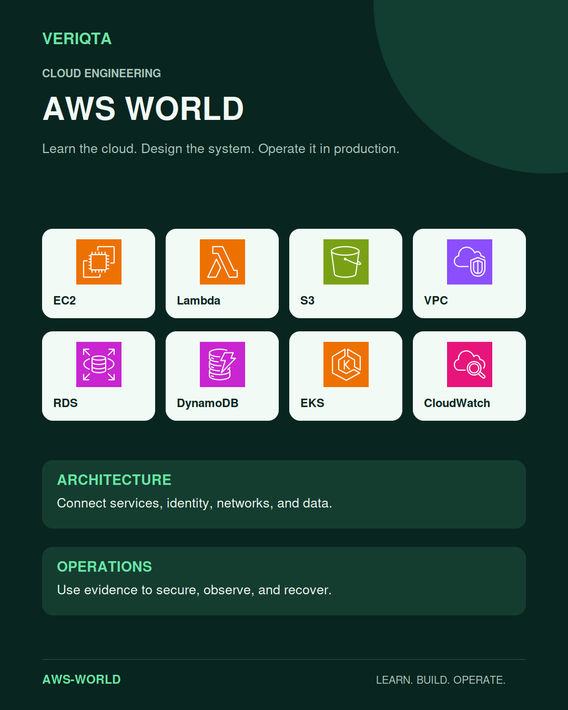
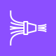
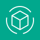
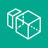
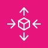
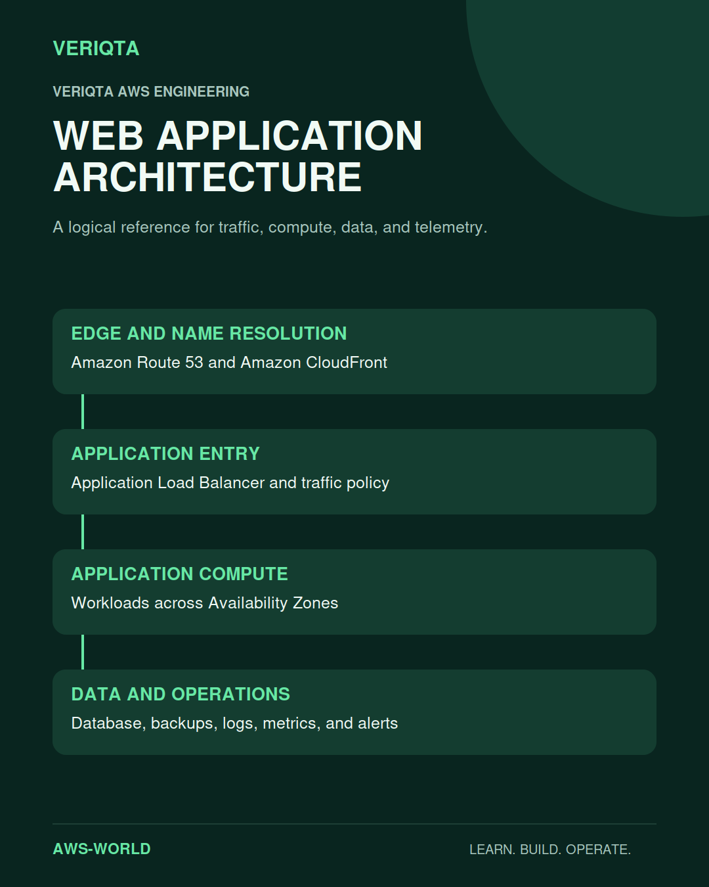
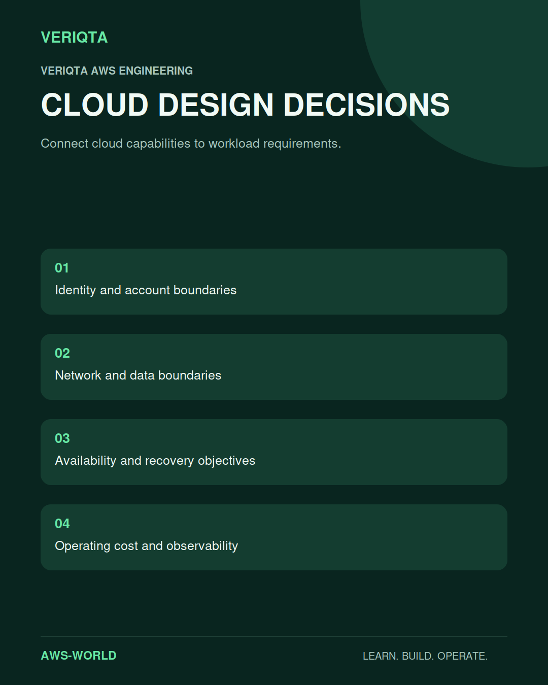
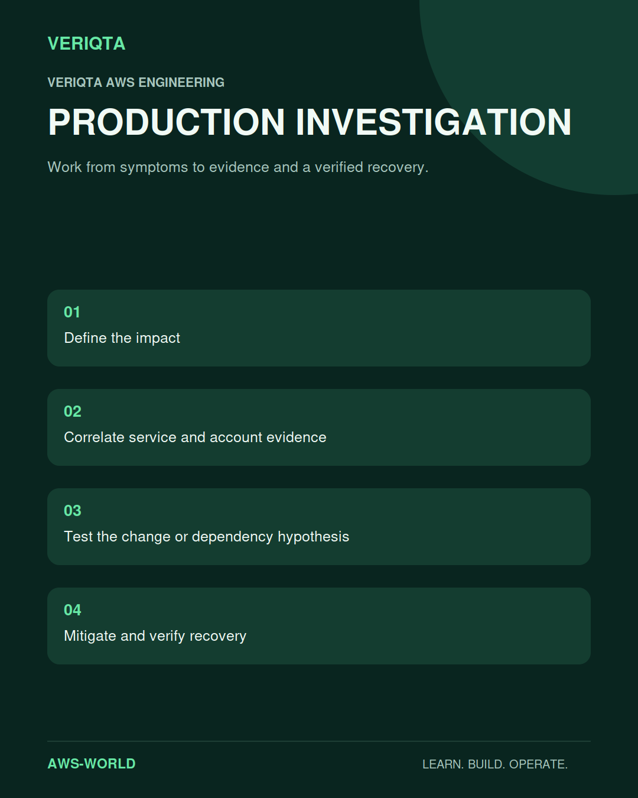

# AWS-WORLD

### Learn the cloud. Design the system. Operate it in production.

AWS-WORLD is VERIQTA's learning and reference hub for AWS engineering. Explore cloud foundations, service behaviour, architecture, identity, networking, security, data, automation, observability, and production operations.

Connect individual AWS services to the systems they support. Study the design decisions, dependencies, failure modes, cost considerations, and evidence that matter when a workload runs in production.

## Choose your starting point

| Your goal | Explore |
| :--- | :--- |
| Begin learning AWS | [Start here](00-Start-Here/) and [learning paths](01-Beginner-to-Advanced/) |
| Understand cloud fundamentals | [Cloud and AWS foundations](02-Cloud-and-AWS-Foundations/) |
| Establish accounts and access | [Identity and governance](03-Accounts-Identity-and-Governance/) |
| Connect cloud workloads | [Networking and content delivery](04-Networking-and-Content-Delivery/) |
| Design compute and data services | [Compute](05-Compute/), [storage](06-Storage-Backup-and-Disaster-Recovery/), and [databases](07-Databases-and-Caching/) |
| Build event-driven applications | [Serverless and integration](08-Serverless-and-Application-Integration/) |
| Run container platforms | [Containers and orchestration](09-Containers-and-Orchestration/) |
| Investigate production behaviour | [Observability](12-Observability-and-CloudOps/), [troubleshooting](22-Troubleshooting/), and [operations](23-Production-Operations/) |
| Practise engineering | [Projects](20-Projects/) and [labs](21-Labs/) |
| Prepare for interviews or certification | [Interviews](26-Interview-Preparation/) and [certifications](25-Certification-Preparation/) |

## Explore the complete learning catalogue

| Subject | Explore |
| :--- | :--- |
| Start Here | [Explore](00-Start-Here/) |
| Beginner to Advanced | [Explore](01-Beginner-to-Advanced/) |
| Cloud and AWS Foundations | [Explore](02-Cloud-and-AWS-Foundations/) |
| Accounts Identity and Governance | [Explore](03-Accounts-Identity-and-Governance/) |
| Networking and Content Delivery | [Explore](04-Networking-and-Content-Delivery/) |
| Compute | [Explore](05-Compute/) |
| Storage Backup and Disaster Recovery | [Explore](06-Storage-Backup-and-Disaster-Recovery/) |
| Databases and Caching | [Explore](07-Databases-and-Caching/) |
| Serverless and Application Integration | [Explore](08-Serverless-and-Application-Integration/) |
| Containers and Orchestration | [Explore](09-Containers-and-Orchestration/) |
| Infrastructure as Code and Automation | [Explore](10-Infrastructure-as-Code-and-Automation/) |
| Developer Tools and CI CD | [Explore](11-Developer-Tools-and-CI-CD/) |
| Observability and CloudOps | [Explore](12-Observability-and-CloudOps/) |
| Well Architected and Solutions Architecture | [Explore](13-Well-Architected-and-Solutions-Architecture/) |
| Security Risk and Compliance | [Explore](14-Security-Risk-and-Compliance/) |
| Cost Management and FinOps | [Explore](15-Cost-Management-and-FinOps/) |
| Data Analytics and Streaming | [Explore](16-Data-Analytics-and-Streaming/) |
| AI ML and Generative AI | [Explore](17-AI-ML-and-Generative-AI/) |
| Migration Hybrid and Edge | [Explore](18-Migration-Hybrid-and-Edge/) |
| Reliability Performance and Resilience | [Explore](19-Reliability-Performance-and-Resilience/) |
| Projects | [Explore](20-Projects/) |
| Labs | [Explore](21-Labs/) |
| Troubleshooting | [Explore](22-Troubleshooting/) |
| Production Operations | [Explore](23-Production-Operations/) |
| Architecture Patterns | [Explore](24-Architecture-Patterns/) |
| Certification Preparation | [Explore](25-Certification-Preparation/) |
| Interview Preparation | [Explore](26-Interview-Preparation/) |
| Engineer Notebooks | [Explore](27-Engineer-Notebooks/) |
| Toolkit | [Explore](28-Toolkit/) |
| Service Catalog | [Explore](29-Service-Catalog/) |
| Resources | [Explore](30-Resources/) |
| Cloud Adoption and Transformation | [Explore](31-Cloud-Adoption-and-Transformation/) |
| SaaS and Multi Tenant Architecture | [Explore](32-SaaS-and-Multi-Tenant-Architecture/) |
| Specialized Workloads | [Explore](33-Specialized-Workloads/) |

## AWS service and component catalogue

Explore services by category, then connect them to their architecture, security, operating behaviour, practical exercises, and engineering questions.

<b>Analytics: 20 entries</b>

| AWS service or component | Icon | Learn | Labs | Questions |
|---|---|---|---|---|
| AWS Clean Rooms |  | [Explore](29-Service-Catalog/analytics/aws-clean-rooms/) | [Explore](29-Service-Catalog/analytics/aws-clean-rooms/04-hands-on-labs.md) | [Explore](29-Service-Catalog/analytics/aws-clean-rooms/08-interview-questions.md) |
| AWS Data Exchange |  | [Explore](29-Service-Catalog/analytics/aws-data-exchange/) | [Explore](29-Service-Catalog/analytics/aws-data-exchange/04-hands-on-labs.md) | [Explore](29-Service-Catalog/analytics/aws-data-exchange/08-interview-questions.md) |
| AWS Entity Resolution |  | [Explore](29-Service-Catalog/analytics/aws-entity-resolution/) | [Explore](29-Service-Catalog/analytics/aws-entity-resolution/04-hands-on-labs.md) | [Explore](29-Service-Catalog/analytics/aws-entity-resolution/08-interview-questions.md) |
| AWS Glue |  | [Explore](29-Service-Catalog/analytics/aws-glue/) | [Explore](29-Service-Catalog/analytics/aws-glue/04-hands-on-labs.md) | [Explore](29-Service-Catalog/analytics/aws-glue/08-interview-questions.md) |
| AWS Glue DataBrew |  | [Explore](29-Service-Catalog/analytics/aws-glue-databrew/) | [Explore](29-Service-Catalog/analytics/aws-glue-databrew/04-hands-on-labs.md) | [Explore](29-Service-Catalog/analytics/aws-glue-databrew/08-interview-questions.md) |
| AWS Lake Formation |  | [Explore](29-Service-Catalog/analytics/aws-lake-formation/) | [Explore](29-Service-Catalog/analytics/aws-lake-formation/04-hands-on-labs.md) | [Explore](29-Service-Catalog/analytics/aws-lake-formation/08-interview-questions.md) |
| Amazon Athena |  | [Explore](29-Service-Catalog/analytics/amazon-athena/) | [Explore](29-Service-Catalog/analytics/amazon-athena/04-hands-on-labs.md) | [Explore](29-Service-Catalog/analytics/amazon-athena/08-interview-questions.md) |
| Amazon CloudSearch |  | [Explore](29-Service-Catalog/analytics/amazon-cloudsearch/) | [Explore](29-Service-Catalog/analytics/amazon-cloudsearch/04-hands-on-labs.md) | [Explore](29-Service-Catalog/analytics/amazon-cloudsearch/08-interview-questions.md) |
| Amazon Data Firehose |  | [Explore](29-Service-Catalog/analytics/amazon-data-firehose/) | [Explore](29-Service-Catalog/analytics/amazon-data-firehose/04-hands-on-labs.md) | [Explore](29-Service-Catalog/analytics/amazon-data-firehose/08-interview-questions.md) |
| Amazon DataZone |  | [Explore](29-Service-Catalog/analytics/amazon-datazone/) | [Explore](29-Service-Catalog/analytics/amazon-datazone/04-hands-on-labs.md) | [Explore](29-Service-Catalog/analytics/amazon-datazone/08-interview-questions.md) |
| Amazon EMR |  | [Explore](29-Service-Catalog/analytics/amazon-emr/) | [Explore](29-Service-Catalog/analytics/amazon-emr/04-hands-on-labs.md) | [Explore](29-Service-Catalog/analytics/amazon-emr/08-interview-questions.md) |
| Amazon FinSpace |  | [Explore](29-Service-Catalog/analytics/amazon-finspace/) | [Explore](29-Service-Catalog/analytics/amazon-finspace/04-hands-on-labs.md) | [Explore](29-Service-Catalog/analytics/amazon-finspace/08-interview-questions.md) |
| Amazon Kinesis |  | [Explore](29-Service-Catalog/analytics/amazon-kinesis/) | [Explore](29-Service-Catalog/analytics/amazon-kinesis/04-hands-on-labs.md) | [Explore](29-Service-Catalog/analytics/amazon-kinesis/08-interview-questions.md) |
| Amazon Kinesis Data Streams |  | [Explore](29-Service-Catalog/analytics/amazon-kinesis-data-streams/) | [Explore](29-Service-Catalog/analytics/amazon-kinesis-data-streams/04-hands-on-labs.md) | [Explore](29-Service-Catalog/analytics/amazon-kinesis-data-streams/08-interview-questions.md) |
| Amazon Kinesis Video Streams |  | [Explore](29-Service-Catalog/analytics/amazon-kinesis-video-streams/) | [Explore](29-Service-Catalog/analytics/amazon-kinesis-video-streams/04-hands-on-labs.md) | [Explore](29-Service-Catalog/analytics/amazon-kinesis-video-streams/08-interview-questions.md) |
| Amazon Managed Service for Apache Flink |  | [Explore](29-Service-Catalog/analytics/amazon-managed-service-for-apache-flink/) | [Explore](29-Service-Catalog/analytics/amazon-managed-service-for-apache-flink/04-hands-on-labs.md) | [Explore](29-Service-Catalog/analytics/amazon-managed-service-for-apache-flink/08-interview-questions.md) |
| Amazon Managed Streaming for Apache Kafka |  | [Explore](29-Service-Catalog/analytics/amazon-managed-streaming-for-apache-kafka/) | [Explore](29-Service-Catalog/analytics/amazon-managed-streaming-for-apache-kafka/04-hands-on-labs.md) | [Explore](29-Service-Catalog/analytics/amazon-managed-streaming-for-apache-kafka/08-interview-questions.md) |
| Amazon OpenSearch Service |  | [Explore](29-Service-Catalog/analytics/amazon-opensearch-service/) | [Explore](29-Service-Catalog/analytics/amazon-opensearch-service/04-hands-on-labs.md) | [Explore](29-Service-Catalog/analytics/amazon-opensearch-service/08-interview-questions.md) |
| Amazon Redshift |  | [Explore](29-Service-Catalog/analytics/amazon-redshift/) | [Explore](29-Service-Catalog/analytics/amazon-redshift/04-hands-on-labs.md) | [Explore](29-Service-Catalog/analytics/amazon-redshift/08-interview-questions.md) |
| Amazon SageMaker |  | [Explore](29-Service-Catalog/analytics/amazon-sagemaker/) | [Explore](29-Service-Catalog/analytics/amazon-sagemaker/04-hands-on-labs.md) | [Explore](29-Service-Catalog/analytics/amazon-sagemaker/08-interview-questions.md) |

<b>Application Integration: 10 entries</b>

| AWS service or component | Icon | Learn | Labs | Questions |
|---|---|---|---|---|
| AWS AppSync |  | [Explore](29-Service-Catalog/application-integration/aws-appsync/) | [Explore](29-Service-Catalog/application-integration/aws-appsync/04-hands-on-labs.md) | [Explore](29-Service-Catalog/application-integration/aws-appsync/08-interview-questions.md) |
| AWS B2B Data Interchange |  | [Explore](29-Service-Catalog/application-integration/aws-b2b-data-interchange/) | [Explore](29-Service-Catalog/application-integration/aws-b2b-data-interchange/04-hands-on-labs.md) | [Explore](29-Service-Catalog/application-integration/aws-b2b-data-interchange/08-interview-questions.md) |
| AWS Express Workflows |  | [Explore](29-Service-Catalog/application-integration/aws-express-workflows/) | [Explore](29-Service-Catalog/application-integration/aws-express-workflows/04-hands-on-labs.md) | [Explore](29-Service-Catalog/application-integration/aws-express-workflows/08-interview-questions.md) |
| AWS Step Functions |  | [Explore](29-Service-Catalog/application-integration/aws-step-functions/) | [Explore](29-Service-Catalog/application-integration/aws-step-functions/04-hands-on-labs.md) | [Explore](29-Service-Catalog/application-integration/aws-step-functions/08-interview-questions.md) |
| Amazon AppFlow |  | [Explore](29-Service-Catalog/application-integration/amazon-appflow/) | [Explore](29-Service-Catalog/application-integration/amazon-appflow/04-hands-on-labs.md) | [Explore](29-Service-Catalog/application-integration/amazon-appflow/08-interview-questions.md) |
| Amazon EventBridge |  | [Explore](29-Service-Catalog/application-integration/amazon-eventbridge/) | [Explore](29-Service-Catalog/application-integration/amazon-eventbridge/04-hands-on-labs.md) | [Explore](29-Service-Catalog/application-integration/amazon-eventbridge/08-interview-questions.md) |
| Amazon MQ |  | [Explore](29-Service-Catalog/application-integration/amazon-mq/) | [Explore](29-Service-Catalog/application-integration/amazon-mq/04-hands-on-labs.md) | [Explore](29-Service-Catalog/application-integration/amazon-mq/08-interview-questions.md) |
| Amazon Managed Workflows for Apache Airflow |  | [Explore](29-Service-Catalog/application-integration/amazon-managed-workflows-for-apache-airflow/) | [Explore](29-Service-Catalog/application-integration/amazon-managed-workflows-for-apache-airflow/04-hands-on-labs.md) | [Explore](29-Service-Catalog/application-integration/amazon-managed-workflows-for-apache-airflow/08-interview-questions.md) |
| Amazon Simple Notification Service |  | [Explore](29-Service-Catalog/application-integration/amazon-simple-notification-service/) | [Explore](29-Service-Catalog/application-integration/amazon-simple-notification-service/04-hands-on-labs.md) | [Explore](29-Service-Catalog/application-integration/amazon-simple-notification-service/08-interview-questions.md) |
| Amazon Simple Queue Service |  | [Explore](29-Service-Catalog/application-integration/amazon-simple-queue-service/) | [Explore](29-Service-Catalog/application-integration/amazon-simple-queue-service/04-hands-on-labs.md) | [Explore](29-Service-Catalog/application-integration/amazon-simple-queue-service/08-interview-questions.md) |

<b>Artificial Intelligence: 41 entries</b>

| AWS service or component | Icon | Learn | Labs | Questions |
|---|---|---|---|---|
| AWS App Studio |  | [Explore](29-Service-Catalog/artificial-intelligence/aws-app-studio/) | [Explore](29-Service-Catalog/artificial-intelligence/aws-app-studio/04-hands-on-labs.md) | [Explore](29-Service-Catalog/artificial-intelligence/aws-app-studio/08-interview-questions.md) |
| AWS Deep Learning AMIs |  | [Explore](29-Service-Catalog/artificial-intelligence/aws-deep-learning-amis/) | [Explore](29-Service-Catalog/artificial-intelligence/aws-deep-learning-amis/04-hands-on-labs.md) | [Explore](29-Service-Catalog/artificial-intelligence/aws-deep-learning-amis/08-interview-questions.md) |
| AWS Deep Learning Containers |  | [Explore](29-Service-Catalog/artificial-intelligence/aws-deep-learning-containers/) | [Explore](29-Service-Catalog/artificial-intelligence/aws-deep-learning-containers/04-hands-on-labs.md) | [Explore](29-Service-Catalog/artificial-intelligence/aws-deep-learning-containers/08-interview-questions.md) |
| AWS DeepRacer |  | [Explore](29-Service-Catalog/artificial-intelligence/aws-deepracer/) | [Explore](29-Service-Catalog/artificial-intelligence/aws-deepracer/04-hands-on-labs.md) | [Explore](29-Service-Catalog/artificial-intelligence/aws-deepracer/08-interview-questions.md) |
| AWS Elemental Inference |  | [Explore](29-Service-Catalog/artificial-intelligence/aws-elemental-inference/) | [Explore](29-Service-Catalog/artificial-intelligence/aws-elemental-inference/04-hands-on-labs.md) | [Explore](29-Service-Catalog/artificial-intelligence/aws-elemental-inference/08-interview-questions.md) |
| AWS HealthImaging |  | [Explore](29-Service-Catalog/artificial-intelligence/aws-healthimaging/) | [Explore](29-Service-Catalog/artificial-intelligence/aws-healthimaging/04-hands-on-labs.md) | [Explore](29-Service-Catalog/artificial-intelligence/aws-healthimaging/08-interview-questions.md) |
| AWS HealthLake |  | [Explore](29-Service-Catalog/artificial-intelligence/aws-healthlake/) | [Explore](29-Service-Catalog/artificial-intelligence/aws-healthlake/04-hands-on-labs.md) | [Explore](29-Service-Catalog/artificial-intelligence/aws-healthlake/08-interview-questions.md) |
| AWS HealthOmics |  | [Explore](29-Service-Catalog/artificial-intelligence/aws-healthomics/) | [Explore](29-Service-Catalog/artificial-intelligence/aws-healthomics/04-hands-on-labs.md) | [Explore](29-Service-Catalog/artificial-intelligence/aws-healthomics/08-interview-questions.md) |
| AWS HealthScribe |  | [Explore](29-Service-Catalog/artificial-intelligence/aws-healthscribe/) | [Explore](29-Service-Catalog/artificial-intelligence/aws-healthscribe/04-hands-on-labs.md) | [Explore](29-Service-Catalog/artificial-intelligence/aws-healthscribe/08-interview-questions.md) |
| AWS Neuron |  | [Explore](29-Service-Catalog/artificial-intelligence/aws-neuron/) | [Explore](29-Service-Catalog/artificial-intelligence/aws-neuron/04-hands-on-labs.md) | [Explore](29-Service-Catalog/artificial-intelligence/aws-neuron/08-interview-questions.md) |
| AWS Panorama |  | [Explore](29-Service-Catalog/artificial-intelligence/aws-panorama/) | [Explore](29-Service-Catalog/artificial-intelligence/aws-panorama/04-hands-on-labs.md) | [Explore](29-Service-Catalog/artificial-intelligence/aws-panorama/08-interview-questions.md) |
| Amazon Augmented AI A2I |  | [Explore](29-Service-Catalog/artificial-intelligence/amazon-augmented-ai-a2i/) | [Explore](29-Service-Catalog/artificial-intelligence/amazon-augmented-ai-a2i/04-hands-on-labs.md) | [Explore](29-Service-Catalog/artificial-intelligence/amazon-augmented-ai-a2i/08-interview-questions.md) |
| Amazon Bedrock |  | [Explore](29-Service-Catalog/artificial-intelligence/amazon-bedrock/) | [Explore](29-Service-Catalog/artificial-intelligence/amazon-bedrock/04-hands-on-labs.md) | [Explore](29-Service-Catalog/artificial-intelligence/amazon-bedrock/08-interview-questions.md) |
| Amazon Bedrock AgentCore |  | [Explore](29-Service-Catalog/artificial-intelligence/amazon-bedrock-agentcore/) | [Explore](29-Service-Catalog/artificial-intelligence/amazon-bedrock-agentcore/04-hands-on-labs.md) | [Explore](29-Service-Catalog/artificial-intelligence/amazon-bedrock-agentcore/08-interview-questions.md) |
| Amazon CodeGuru |  | [Explore](29-Service-Catalog/artificial-intelligence/amazon-codeguru/) | [Explore](29-Service-Catalog/artificial-intelligence/amazon-codeguru/04-hands-on-labs.md) | [Explore](29-Service-Catalog/artificial-intelligence/amazon-codeguru/08-interview-questions.md) |
| Amazon CodeWhisperer |  | [Explore](29-Service-Catalog/artificial-intelligence/amazon-codewhisperer/) | [Explore](29-Service-Catalog/artificial-intelligence/amazon-codewhisperer/04-hands-on-labs.md) | [Explore](29-Service-Catalog/artificial-intelligence/amazon-codewhisperer/08-interview-questions.md) |
| Amazon Comprehend |  | [Explore](29-Service-Catalog/artificial-intelligence/amazon-comprehend/) | [Explore](29-Service-Catalog/artificial-intelligence/amazon-comprehend/04-hands-on-labs.md) | [Explore](29-Service-Catalog/artificial-intelligence/amazon-comprehend/08-interview-questions.md) |
| Amazon Comprehend Medical |  | [Explore](29-Service-Catalog/artificial-intelligence/amazon-comprehend-medical/) | [Explore](29-Service-Catalog/artificial-intelligence/amazon-comprehend-medical/04-hands-on-labs.md) | [Explore](29-Service-Catalog/artificial-intelligence/amazon-comprehend-medical/08-interview-questions.md) |
| Amazon DevOps Guru |  | [Explore](29-Service-Catalog/artificial-intelligence/amazon-devops-guru/) | [Explore](29-Service-Catalog/artificial-intelligence/amazon-devops-guru/04-hands-on-labs.md) | [Explore](29-Service-Catalog/artificial-intelligence/amazon-devops-guru/08-interview-questions.md) |
| Amazon Elastic Inference |  | [Explore](29-Service-Catalog/artificial-intelligence/amazon-elastic-inference/) | [Explore](29-Service-Catalog/artificial-intelligence/amazon-elastic-inference/04-hands-on-labs.md) | [Explore](29-Service-Catalog/artificial-intelligence/amazon-elastic-inference/08-interview-questions.md) |
| Amazon Forecast |  | [Explore](29-Service-Catalog/artificial-intelligence/amazon-forecast/) | [Explore](29-Service-Catalog/artificial-intelligence/amazon-forecast/04-hands-on-labs.md) | [Explore](29-Service-Catalog/artificial-intelligence/amazon-forecast/08-interview-questions.md) |
| Amazon Fraud Detector |  | [Explore](29-Service-Catalog/artificial-intelligence/amazon-fraud-detector/) | [Explore](29-Service-Catalog/artificial-intelligence/amazon-fraud-detector/04-hands-on-labs.md) | [Explore](29-Service-Catalog/artificial-intelligence/amazon-fraud-detector/08-interview-questions.md) |
| Amazon Kendra |  | [Explore](29-Service-Catalog/artificial-intelligence/amazon-kendra/) | [Explore](29-Service-Catalog/artificial-intelligence/amazon-kendra/04-hands-on-labs.md) | [Explore](29-Service-Catalog/artificial-intelligence/amazon-kendra/08-interview-questions.md) |
| Amazon Lex |  | [Explore](29-Service-Catalog/artificial-intelligence/amazon-lex/) | [Explore](29-Service-Catalog/artificial-intelligence/amazon-lex/04-hands-on-labs.md) | [Explore](29-Service-Catalog/artificial-intelligence/amazon-lex/08-interview-questions.md) |
| Amazon Lookout for Equipment |  | [Explore](29-Service-Catalog/artificial-intelligence/amazon-lookout-for-equipment/) | [Explore](29-Service-Catalog/artificial-intelligence/amazon-lookout-for-equipment/04-hands-on-labs.md) | [Explore](29-Service-Catalog/artificial-intelligence/amazon-lookout-for-equipment/08-interview-questions.md) |
| Amazon Lookout for Vision |  | [Explore](29-Service-Catalog/artificial-intelligence/amazon-lookout-for-vision/) | [Explore](29-Service-Catalog/artificial-intelligence/amazon-lookout-for-vision/04-hands-on-labs.md) | [Explore](29-Service-Catalog/artificial-intelligence/amazon-lookout-for-vision/08-interview-questions.md) |
| Amazon Monitron |  | [Explore](29-Service-Catalog/artificial-intelligence/amazon-monitron/) | [Explore](29-Service-Catalog/artificial-intelligence/amazon-monitron/04-hands-on-labs.md) | [Explore](29-Service-Catalog/artificial-intelligence/amazon-monitron/08-interview-questions.md) |
| Amazon Nova |  | [Explore](29-Service-Catalog/artificial-intelligence/amazon-nova/) | [Explore](29-Service-Catalog/artificial-intelligence/amazon-nova/04-hands-on-labs.md) | [Explore](29-Service-Catalog/artificial-intelligence/amazon-nova/08-interview-questions.md) |
| Amazon Personalize |  | [Explore](29-Service-Catalog/artificial-intelligence/amazon-personalize/) | [Explore](29-Service-Catalog/artificial-intelligence/amazon-personalize/04-hands-on-labs.md) | [Explore](29-Service-Catalog/artificial-intelligence/amazon-personalize/08-interview-questions.md) |
| Amazon Polly |  | [Explore](29-Service-Catalog/artificial-intelligence/amazon-polly/) | [Explore](29-Service-Catalog/artificial-intelligence/amazon-polly/04-hands-on-labs.md) | [Explore](29-Service-Catalog/artificial-intelligence/amazon-polly/08-interview-questions.md) |
| Amazon Q |  | [Explore](29-Service-Catalog/artificial-intelligence/amazon-q/) | [Explore](29-Service-Catalog/artificial-intelligence/amazon-q/04-hands-on-labs.md) | [Explore](29-Service-Catalog/artificial-intelligence/amazon-q/08-interview-questions.md) |
| Amazon Rekognition |  | [Explore](29-Service-Catalog/artificial-intelligence/amazon-rekognition/) | [Explore](29-Service-Catalog/artificial-intelligence/amazon-rekognition/04-hands-on-labs.md) | [Explore](29-Service-Catalog/artificial-intelligence/amazon-rekognition/08-interview-questions.md) |
| Amazon SageMaker AI |  | [Explore](29-Service-Catalog/artificial-intelligence/amazon-sagemaker-ai/) | [Explore](29-Service-Catalog/artificial-intelligence/amazon-sagemaker-ai/04-hands-on-labs.md) | [Explore](29-Service-Catalog/artificial-intelligence/amazon-sagemaker-ai/08-interview-questions.md) |
| Amazon SageMaker Ground Truth |  | [Explore](29-Service-Catalog/artificial-intelligence/amazon-sagemaker-ground-truth/) | [Explore](29-Service-Catalog/artificial-intelligence/amazon-sagemaker-ground-truth/04-hands-on-labs.md) | [Explore](29-Service-Catalog/artificial-intelligence/amazon-sagemaker-ground-truth/08-interview-questions.md) |
| Amazon SageMaker Studio Lab |  | [Explore](29-Service-Catalog/artificial-intelligence/amazon-sagemaker-studio-lab/) | [Explore](29-Service-Catalog/artificial-intelligence/amazon-sagemaker-studio-lab/04-hands-on-labs.md) | [Explore](29-Service-Catalog/artificial-intelligence/amazon-sagemaker-studio-lab/08-interview-questions.md) |
| Amazon Textract |  | [Explore](29-Service-Catalog/artificial-intelligence/amazon-textract/) | [Explore](29-Service-Catalog/artificial-intelligence/amazon-textract/04-hands-on-labs.md) | [Explore](29-Service-Catalog/artificial-intelligence/amazon-textract/08-interview-questions.md) |
| Amazon Transcribe |  | [Explore](29-Service-Catalog/artificial-intelligence/amazon-transcribe/) | [Explore](29-Service-Catalog/artificial-intelligence/amazon-transcribe/04-hands-on-labs.md) | [Explore](29-Service-Catalog/artificial-intelligence/amazon-transcribe/08-interview-questions.md) |
| Amazon Translate |  | [Explore](29-Service-Catalog/artificial-intelligence/amazon-translate/) | [Explore](29-Service-Catalog/artificial-intelligence/amazon-translate/04-hands-on-labs.md) | [Explore](29-Service-Catalog/artificial-intelligence/amazon-translate/08-interview-questions.md) |
| Apache MXNet on AWS |  | [Explore](29-Service-Catalog/artificial-intelligence/apache-mxnet-on-aws/) | [Explore](29-Service-Catalog/artificial-intelligence/apache-mxnet-on-aws/04-hands-on-labs.md) | [Explore](29-Service-Catalog/artificial-intelligence/apache-mxnet-on-aws/08-interview-questions.md) |
| PyTorch on AWS |  | [Explore](29-Service-Catalog/artificial-intelligence/pytorch-on-aws/) | [Explore](29-Service-Catalog/artificial-intelligence/pytorch-on-aws/04-hands-on-labs.md) | [Explore](29-Service-Catalog/artificial-intelligence/pytorch-on-aws/08-interview-questions.md) |
| TensorFlow on AWS |  | [Explore](29-Service-Catalog/artificial-intelligence/tensorflow-on-aws/) | [Explore](29-Service-Catalog/artificial-intelligence/tensorflow-on-aws/04-hands-on-labs.md) | [Explore](29-Service-Catalog/artificial-intelligence/tensorflow-on-aws/08-interview-questions.md) |

<b>Blockchain: 1 entries</b>

| AWS service or component | Icon | Learn | Labs | Questions |
|---|---|---|---|---|
| Amazon Managed Blockchain |  | [Explore](29-Service-Catalog/blockchain/amazon-managed-blockchain/) | [Explore](29-Service-Catalog/blockchain/amazon-managed-blockchain/04-hands-on-labs.md) | [Explore](29-Service-Catalog/blockchain/amazon-managed-blockchain/08-interview-questions.md) |

<b>Business Applications: 14 entries</b>

| AWS service or component | Icon | Learn | Labs | Questions |
|---|---|---|---|---|
| AWS AppFabric |  | [Explore](29-Service-Catalog/business-applications/aws-appfabric/) | [Explore](29-Service-Catalog/business-applications/aws-appfabric/04-hands-on-labs.md) | [Explore](29-Service-Catalog/business-applications/aws-appfabric/08-interview-questions.md) |
| AWS End User Messaging |  | [Explore](29-Service-Catalog/business-applications/aws-end-user-messaging/) | [Explore](29-Service-Catalog/business-applications/aws-end-user-messaging/04-hands-on-labs.md) | [Explore](29-Service-Catalog/business-applications/aws-end-user-messaging/08-interview-questions.md) |
| AWS Supply Chain |  | [Explore](29-Service-Catalog/business-applications/aws-supply-chain/) | [Explore](29-Service-Catalog/business-applications/aws-supply-chain/04-hands-on-labs.md) | [Explore](29-Service-Catalog/business-applications/aws-supply-chain/08-interview-questions.md) |
| AWS Wickr |  | [Explore](29-Service-Catalog/business-applications/aws-wickr/) | [Explore](29-Service-Catalog/business-applications/aws-wickr/04-hands-on-labs.md) | [Explore](29-Service-Catalog/business-applications/aws-wickr/08-interview-questions.md) |
| Amazon Chime |  | [Explore](29-Service-Catalog/business-applications/amazon-chime/) | [Explore](29-Service-Catalog/business-applications/amazon-chime/04-hands-on-labs.md) | [Explore](29-Service-Catalog/business-applications/amazon-chime/08-interview-questions.md) |
| Amazon Chime SDK |  | [Explore](29-Service-Catalog/business-applications/amazon-chime-sdk/) | [Explore](29-Service-Catalog/business-applications/amazon-chime-sdk/04-hands-on-labs.md) | [Explore](29-Service-Catalog/business-applications/amazon-chime-sdk/08-interview-questions.md) |
| Amazon Connect |  | [Explore](29-Service-Catalog/business-applications/amazon-connect/) | [Explore](29-Service-Catalog/business-applications/amazon-connect/04-hands-on-labs.md) | [Explore](29-Service-Catalog/business-applications/amazon-connect/08-interview-questions.md) |
| Amazon Pinpoint |  | [Explore](29-Service-Catalog/business-applications/amazon-pinpoint/) | [Explore](29-Service-Catalog/business-applications/amazon-pinpoint/04-hands-on-labs.md) | [Explore](29-Service-Catalog/business-applications/amazon-pinpoint/08-interview-questions.md) |
| Amazon Pinpoint APIs |  | [Explore](29-Service-Catalog/business-applications/amazon-pinpoint-apis/) | [Explore](29-Service-Catalog/business-applications/amazon-pinpoint-apis/04-hands-on-labs.md) | [Explore](29-Service-Catalog/business-applications/amazon-pinpoint-apis/08-interview-questions.md) |
| Amazon Quick |  | [Explore](29-Service-Catalog/business-applications/amazon-quick/) | [Explore](29-Service-Catalog/business-applications/amazon-quick/04-hands-on-labs.md) | [Explore](29-Service-Catalog/business-applications/amazon-quick/08-interview-questions.md) |
| Amazon Simple Email Service |  | [Explore](29-Service-Catalog/business-applications/amazon-simple-email-service/) | [Explore](29-Service-Catalog/business-applications/amazon-simple-email-service/04-hands-on-labs.md) | [Explore](29-Service-Catalog/business-applications/amazon-simple-email-service/08-interview-questions.md) |
| Amazon WorkDocs |  | [Explore](29-Service-Catalog/business-applications/amazon-workdocs/) | [Explore](29-Service-Catalog/business-applications/amazon-workdocs/04-hands-on-labs.md) | [Explore](29-Service-Catalog/business-applications/amazon-workdocs/08-interview-questions.md) |
| Amazon WorkDocs SDK |  | [Explore](29-Service-Catalog/business-applications/amazon-workdocs-sdk/) | [Explore](29-Service-Catalog/business-applications/amazon-workdocs-sdk/04-hands-on-labs.md) | [Explore](29-Service-Catalog/business-applications/amazon-workdocs-sdk/08-interview-questions.md) |
| Amazon WorkMail |  | [Explore](29-Service-Catalog/business-applications/amazon-workmail/) | [Explore](29-Service-Catalog/business-applications/amazon-workmail/04-hands-on-labs.md) | [Explore](29-Service-Catalog/business-applications/amazon-workmail/08-interview-questions.md) |

<b>Cloud Financial Management: 7 entries</b>

| AWS service or component | Icon | Learn | Labs | Questions |
|---|---|---|---|---|
| AWS Billing Conductor |  | [Explore](29-Service-Catalog/cloud-financial-management/aws-billing-conductor/) | [Explore](29-Service-Catalog/cloud-financial-management/aws-billing-conductor/04-hands-on-labs.md) | [Explore](29-Service-Catalog/cloud-financial-management/aws-billing-conductor/08-interview-questions.md) |
| AWS Budgets |  | [Explore](29-Service-Catalog/cloud-financial-management/aws-budgets/) | [Explore](29-Service-Catalog/cloud-financial-management/aws-budgets/04-hands-on-labs.md) | [Explore](29-Service-Catalog/cloud-financial-management/aws-budgets/08-interview-questions.md) |
| AWS Cost Explorer |  | [Explore](29-Service-Catalog/cloud-financial-management/aws-cost-explorer/) | [Explore](29-Service-Catalog/cloud-financial-management/aws-cost-explorer/04-hands-on-labs.md) | [Explore](29-Service-Catalog/cloud-financial-management/aws-cost-explorer/08-interview-questions.md) |
| AWS Cost and Usage Report |  | [Explore](29-Service-Catalog/cloud-financial-management/aws-cost-and-usage-report/) | [Explore](29-Service-Catalog/cloud-financial-management/aws-cost-and-usage-report/04-hands-on-labs.md) | [Explore](29-Service-Catalog/cloud-financial-management/aws-cost-and-usage-report/08-interview-questions.md) |
| AWS FinOps Agent |  | [Explore](29-Service-Catalog/cloud-financial-management/aws-finops-agent/) | [Explore](29-Service-Catalog/cloud-financial-management/aws-finops-agent/04-hands-on-labs.md) | [Explore](29-Service-Catalog/cloud-financial-management/aws-finops-agent/08-interview-questions.md) |
| Reserved Instance Reporting |  | [Explore](29-Service-Catalog/cloud-financial-management/reserved-instance-reporting/) | [Explore](29-Service-Catalog/cloud-financial-management/reserved-instance-reporting/04-hands-on-labs.md) | [Explore](29-Service-Catalog/cloud-financial-management/reserved-instance-reporting/08-interview-questions.md) |
| Savings Plans |  | [Explore](29-Service-Catalog/cloud-financial-management/savings-plans/) | [Explore](29-Service-Catalog/cloud-financial-management/savings-plans/04-hands-on-labs.md) | [Explore](29-Service-Catalog/cloud-financial-management/savings-plans/08-interview-questions.md) |

<b>Compute: 24 entries</b>

| AWS service or component | Icon | Learn | Labs | Questions |
|---|---|---|---|---|
| AWS App Runner |  | [Explore](29-Service-Catalog/compute/aws-app-runner/) | [Explore](29-Service-Catalog/compute/aws-app-runner/04-hands-on-labs.md) | [Explore](29-Service-Catalog/compute/aws-app-runner/08-interview-questions.md) |
| AWS Batch |  | [Explore](29-Service-Catalog/compute/aws-batch/) | [Explore](29-Service-Catalog/compute/aws-batch/04-hands-on-labs.md) | [Explore](29-Service-Catalog/compute/aws-batch/08-interview-questions.md) |
| AWS Compute Optimizer |  | [Explore](29-Service-Catalog/compute/aws-compute-optimizer/) | [Explore](29-Service-Catalog/compute/aws-compute-optimizer/04-hands-on-labs.md) | [Explore](29-Service-Catalog/compute/aws-compute-optimizer/08-interview-questions.md) |
| AWS Elastic Beanstalk |  | [Explore](29-Service-Catalog/compute/aws-elastic-beanstalk/) | [Explore](29-Service-Catalog/compute/aws-elastic-beanstalk/04-hands-on-labs.md) | [Explore](29-Service-Catalog/compute/aws-elastic-beanstalk/08-interview-questions.md) |
| AWS Lambda |  | [Explore](29-Service-Catalog/compute/aws-lambda/) | [Explore](29-Service-Catalog/compute/aws-lambda/04-hands-on-labs.md) | [Explore](29-Service-Catalog/compute/aws-lambda/08-interview-questions.md) |
| AWS Local Zones |  | [Explore](29-Service-Catalog/compute/aws-local-zones/) | [Explore](29-Service-Catalog/compute/aws-local-zones/04-hands-on-labs.md) | [Explore](29-Service-Catalog/compute/aws-local-zones/08-interview-questions.md) |
| AWS Nitro Enclaves |  | [Explore](29-Service-Catalog/compute/aws-nitro-enclaves/) | [Explore](29-Service-Catalog/compute/aws-nitro-enclaves/04-hands-on-labs.md) | [Explore](29-Service-Catalog/compute/aws-nitro-enclaves/08-interview-questions.md) |
| AWS Outposts family |  | [Explore](29-Service-Catalog/compute/aws-outposts-family/) | [Explore](29-Service-Catalog/compute/aws-outposts-family/04-hands-on-labs.md) | [Explore](29-Service-Catalog/compute/aws-outposts-family/08-interview-questions.md) |
| AWS Outposts rack |  | [Explore](29-Service-Catalog/compute/aws-outposts-rack/) | [Explore](29-Service-Catalog/compute/aws-outposts-rack/04-hands-on-labs.md) | [Explore](29-Service-Catalog/compute/aws-outposts-rack/08-interview-questions.md) |
| AWS Outposts servers |  | [Explore](29-Service-Catalog/compute/aws-outposts-servers/) | [Explore](29-Service-Catalog/compute/aws-outposts-servers/04-hands-on-labs.md) | [Explore](29-Service-Catalog/compute/aws-outposts-servers/08-interview-questions.md) |
| AWS Parallel Cluster |  | [Explore](29-Service-Catalog/compute/aws-parallel-cluster/) | [Explore](29-Service-Catalog/compute/aws-parallel-cluster/04-hands-on-labs.md) | [Explore](29-Service-Catalog/compute/aws-parallel-cluster/08-interview-questions.md) |
| AWS Parallel Computing Service |  | [Explore](29-Service-Catalog/compute/aws-parallel-computing-service/) | [Explore](29-Service-Catalog/compute/aws-parallel-computing-service/04-hands-on-labs.md) | [Explore](29-Service-Catalog/compute/aws-parallel-computing-service/08-interview-questions.md) |
| AWS Serverless Application Repository |  | [Explore](29-Service-Catalog/compute/aws-serverless-application-repository/) | [Explore](29-Service-Catalog/compute/aws-serverless-application-repository/04-hands-on-labs.md) | [Explore](29-Service-Catalog/compute/aws-serverless-application-repository/08-interview-questions.md) |
| AWS SimSpace Weaver |  | [Explore](29-Service-Catalog/compute/aws-simspace-weaver/) | [Explore](29-Service-Catalog/compute/aws-simspace-weaver/04-hands-on-labs.md) | [Explore](29-Service-Catalog/compute/aws-simspace-weaver/08-interview-questions.md) |
| AWS Wavelength |  | [Explore](29-Service-Catalog/compute/aws-wavelength/) | [Explore](29-Service-Catalog/compute/aws-wavelength/04-hands-on-labs.md) | [Explore](29-Service-Catalog/compute/aws-wavelength/08-interview-questions.md) |
| Amazon DCV |  | [Explore](29-Service-Catalog/compute/amazon-dcv/) | [Explore](29-Service-Catalog/compute/amazon-dcv/04-hands-on-labs.md) | [Explore](29-Service-Catalog/compute/amazon-dcv/08-interview-questions.md) |
| Amazon EC2 |  | [Explore](29-Service-Catalog/compute/amazon-ec2/) | [Explore](29-Service-Catalog/compute/amazon-ec2/04-hands-on-labs.md) | [Explore](29-Service-Catalog/compute/amazon-ec2/08-interview-questions.md) |
| Amazon EC2 Auto Scaling |  | [Explore](29-Service-Catalog/compute/amazon-ec2-auto-scaling/) | [Explore](29-Service-Catalog/compute/amazon-ec2-auto-scaling/04-hands-on-labs.md) | [Explore](29-Service-Catalog/compute/amazon-ec2-auto-scaling/08-interview-questions.md) |
| Amazon EC2 Image Builder |  | [Explore](29-Service-Catalog/compute/amazon-ec2-image-builder/) | [Explore](29-Service-Catalog/compute/amazon-ec2-image-builder/04-hands-on-labs.md) | [Explore](29-Service-Catalog/compute/amazon-ec2-image-builder/08-interview-questions.md) |
| Amazon Elastic VMware Service |  | [Explore](29-Service-Catalog/compute/amazon-elastic-vmware-service/) | [Explore](29-Service-Catalog/compute/amazon-elastic-vmware-service/04-hands-on-labs.md) | [Explore](29-Service-Catalog/compute/amazon-elastic-vmware-service/08-interview-questions.md) |
| Amazon Lightsail |  | [Explore](29-Service-Catalog/compute/amazon-lightsail/) | [Explore](29-Service-Catalog/compute/amazon-lightsail/04-hands-on-labs.md) | [Explore](29-Service-Catalog/compute/amazon-lightsail/08-interview-questions.md) |
| Amazon Lightsail for Research |  | [Explore](29-Service-Catalog/compute/amazon-lightsail-for-research/) | [Explore](29-Service-Catalog/compute/amazon-lightsail-for-research/04-hands-on-labs.md) | [Explore](29-Service-Catalog/compute/amazon-lightsail-for-research/08-interview-questions.md) |
| Bottlerocket |  | [Explore](29-Service-Catalog/compute/bottlerocket/) | [Explore](29-Service-Catalog/compute/bottlerocket/04-hands-on-labs.md) | [Explore](29-Service-Catalog/compute/bottlerocket/08-interview-questions.md) |
| Elastic Fabric Adapter |  | [Explore](29-Service-Catalog/compute/elastic-fabric-adapter/) | [Explore](29-Service-Catalog/compute/elastic-fabric-adapter/04-hands-on-labs.md) | [Explore](29-Service-Catalog/compute/elastic-fabric-adapter/08-interview-questions.md) |

<b>Containers: 8 entries</b>

| AWS service or component | Icon | Learn | Labs | Questions |
|---|---|---|---|---|
| AWS Fargate |  | [Explore](29-Service-Catalog/containers/aws-fargate/) | [Explore](29-Service-Catalog/containers/aws-fargate/04-hands-on-labs.md) | [Explore](29-Service-Catalog/containers/aws-fargate/08-interview-questions.md) |
| Amazon ECS Anywhere |  | [Explore](29-Service-Catalog/containers/amazon-ecs-anywhere/) | [Explore](29-Service-Catalog/containers/amazon-ecs-anywhere/04-hands-on-labs.md) | [Explore](29-Service-Catalog/containers/amazon-ecs-anywhere/08-interview-questions.md) |
| Amazon EKS Anywhere |  | [Explore](29-Service-Catalog/containers/amazon-eks-anywhere/) | [Explore](29-Service-Catalog/containers/amazon-eks-anywhere/04-hands-on-labs.md) | [Explore](29-Service-Catalog/containers/amazon-eks-anywhere/08-interview-questions.md) |
| Amazon EKS Distro |  | [Explore](29-Service-Catalog/containers/amazon-eks-distro/) | [Explore](29-Service-Catalog/containers/amazon-eks-distro/04-hands-on-labs.md) | [Explore](29-Service-Catalog/containers/amazon-eks-distro/08-interview-questions.md) |
| Amazon Elastic Container Registry |  | [Explore](29-Service-Catalog/containers/amazon-elastic-container-registry/) | [Explore](29-Service-Catalog/containers/amazon-elastic-container-registry/04-hands-on-labs.md) | [Explore](29-Service-Catalog/containers/amazon-elastic-container-registry/08-interview-questions.md) |
| Amazon Elastic Container Service |  | [Explore](29-Service-Catalog/containers/amazon-elastic-container-service/) | [Explore](29-Service-Catalog/containers/amazon-elastic-container-service/04-hands-on-labs.md) | [Explore](29-Service-Catalog/containers/amazon-elastic-container-service/08-interview-questions.md) |
| Amazon Elastic Kubernetes Service |  | [Explore](29-Service-Catalog/containers/amazon-elastic-kubernetes-service/) | [Explore](29-Service-Catalog/containers/amazon-elastic-kubernetes-service/04-hands-on-labs.md) | [Explore](29-Service-Catalog/containers/amazon-elastic-kubernetes-service/08-interview-questions.md) |
| Red Hat OpenShift Service on AWS |  | [Explore](29-Service-Catalog/containers/red-hat-openshift-service-on-aws/) | [Explore](29-Service-Catalog/containers/red-hat-openshift-service-on-aws/04-hands-on-labs.md) | [Explore](29-Service-Catalog/containers/red-hat-openshift-service-on-aws/08-interview-questions.md) |

<b>Customer Enablement: 8 entries</b>

| AWS service or component | Icon | Learn | Labs | Questions |
|---|---|---|---|---|
| AWS Activate |  | [Explore](29-Service-Catalog/customer-enablement/aws-activate/) | [Explore](29-Service-Catalog/customer-enablement/aws-activate/04-hands-on-labs.md) | [Explore](29-Service-Catalog/customer-enablement/aws-activate/08-interview-questions.md) |
| AWS IQ |  | [Explore](29-Service-Catalog/customer-enablement/aws-iq/) | [Explore](29-Service-Catalog/customer-enablement/aws-iq/04-hands-on-labs.md) | [Explore](29-Service-Catalog/customer-enablement/aws-iq/08-interview-questions.md) |
| AWS Managed Services |  | [Explore](29-Service-Catalog/customer-enablement/aws-managed-services/) | [Explore](29-Service-Catalog/customer-enablement/aws-managed-services/04-hands-on-labs.md) | [Explore](29-Service-Catalog/customer-enablement/aws-managed-services/08-interview-questions.md) |
| AWS Professional Services |  | [Explore](29-Service-Catalog/customer-enablement/aws-professional-services/) | [Explore](29-Service-Catalog/customer-enablement/aws-professional-services/04-hands-on-labs.md) | [Explore](29-Service-Catalog/customer-enablement/aws-professional-services/08-interview-questions.md) |
| AWS Support |  | [Explore](29-Service-Catalog/customer-enablement/aws-support/) | [Explore](29-Service-Catalog/customer-enablement/aws-support/04-hands-on-labs.md) | [Explore](29-Service-Catalog/customer-enablement/aws-support/08-interview-questions.md) |
| AWS Training Certification |  | [Explore](29-Service-Catalog/customer-enablement/aws-training-certification/) | [Explore](29-Service-Catalog/customer-enablement/aws-training-certification/04-hands-on-labs.md) | [Explore](29-Service-Catalog/customer-enablement/aws-training-certification/08-interview-questions.md) |
| AWS rePost |  | [Explore](29-Service-Catalog/customer-enablement/aws-repost/) | [Explore](29-Service-Catalog/customer-enablement/aws-repost/04-hands-on-labs.md) | [Explore](29-Service-Catalog/customer-enablement/aws-repost/08-interview-questions.md) |
| AWS rePost Private |  | [Explore](29-Service-Catalog/customer-enablement/aws-repost-private/) | [Explore](29-Service-Catalog/customer-enablement/aws-repost-private/04-hands-on-labs.md) | [Explore](29-Service-Catalog/customer-enablement/aws-repost-private/08-interview-questions.md) |

<b>Databases: 11 entries</b>

| AWS service or component | Icon | Learn | Labs | Questions |
|---|---|---|---|---|
| AWS Database Migration Service |  | [Explore](29-Service-Catalog/databases/aws-database-migration-service/) | [Explore](29-Service-Catalog/databases/aws-database-migration-service/04-hands-on-labs.md) | [Explore](29-Service-Catalog/databases/aws-database-migration-service/08-interview-questions.md) |
| Amazon Aurora |  | [Explore](29-Service-Catalog/databases/amazon-aurora/) | [Explore](29-Service-Catalog/databases/amazon-aurora/04-hands-on-labs.md) | [Explore](29-Service-Catalog/databases/amazon-aurora/08-interview-questions.md) |
| Amazon DocumentDB |  | [Explore](29-Service-Catalog/databases/amazon-documentdb/) | [Explore](29-Service-Catalog/databases/amazon-documentdb/04-hands-on-labs.md) | [Explore](29-Service-Catalog/databases/amazon-documentdb/08-interview-questions.md) |
| Amazon DynamoDB |  | [Explore](29-Service-Catalog/databases/amazon-dynamodb/) | [Explore](29-Service-Catalog/databases/amazon-dynamodb/04-hands-on-labs.md) | [Explore](29-Service-Catalog/databases/amazon-dynamodb/08-interview-questions.md) |
| Amazon ElastiCache |  | [Explore](29-Service-Catalog/databases/amazon-elasticache/) | [Explore](29-Service-Catalog/databases/amazon-elasticache/04-hands-on-labs.md) | [Explore](29-Service-Catalog/databases/amazon-elasticache/08-interview-questions.md) |
| Amazon Keyspaces |  | [Explore](29-Service-Catalog/databases/amazon-keyspaces/) | [Explore](29-Service-Catalog/databases/amazon-keyspaces/04-hands-on-labs.md) | [Explore](29-Service-Catalog/databases/amazon-keyspaces/08-interview-questions.md) |
| Amazon MemoryDB |  | [Explore](29-Service-Catalog/databases/amazon-memorydb/) | [Explore](29-Service-Catalog/databases/amazon-memorydb/04-hands-on-labs.md) | [Explore](29-Service-Catalog/databases/amazon-memorydb/08-interview-questions.md) |
| Amazon Neptune |  | [Explore](29-Service-Catalog/databases/amazon-neptune/) | [Explore](29-Service-Catalog/databases/amazon-neptune/04-hands-on-labs.md) | [Explore](29-Service-Catalog/databases/amazon-neptune/08-interview-questions.md) |
| Amazon RDS |  | [Explore](29-Service-Catalog/databases/amazon-rds/) | [Explore](29-Service-Catalog/databases/amazon-rds/04-hands-on-labs.md) | [Explore](29-Service-Catalog/databases/amazon-rds/08-interview-questions.md) |
| Amazon Timestream |  | [Explore](29-Service-Catalog/databases/amazon-timestream/) | [Explore](29-Service-Catalog/databases/amazon-timestream/04-hands-on-labs.md) | [Explore](29-Service-Catalog/databases/amazon-timestream/08-interview-questions.md) |
| Oracle Database at AWS |  | [Explore](29-Service-Catalog/databases/oracle-database-at-aws/) | [Explore](29-Service-Catalog/databases/oracle-database-at-aws/04-hands-on-labs.md) | [Explore](29-Service-Catalog/databases/oracle-database-at-aws/08-interview-questions.md) |

<b>Developer Tools: 16 entries</b>

| AWS service or component | Icon | Learn | Labs | Questions |
|---|---|---|---|---|
| AWS Cloud Control API |  | [Explore](29-Service-Catalog/developer-tools/aws-cloud-control-api/) | [Explore](29-Service-Catalog/developer-tools/aws-cloud-control-api/04-hands-on-labs.md) | [Explore](29-Service-Catalog/developer-tools/aws-cloud-control-api/08-interview-questions.md) |
| AWS Cloud Development Kit |  | [Explore](29-Service-Catalog/developer-tools/aws-cloud-development-kit/) | [Explore](29-Service-Catalog/developer-tools/aws-cloud-development-kit/04-hands-on-labs.md) | [Explore](29-Service-Catalog/developer-tools/aws-cloud-development-kit/08-interview-questions.md) |
| AWS Cloud9 |  | [Explore](29-Service-Catalog/developer-tools/aws-cloud9/) | [Explore](29-Service-Catalog/developer-tools/aws-cloud9/04-hands-on-labs.md) | [Explore](29-Service-Catalog/developer-tools/aws-cloud9/08-interview-questions.md) |
| AWS CloudShell |  | [Explore](29-Service-Catalog/developer-tools/aws-cloudshell/) | [Explore](29-Service-Catalog/developer-tools/aws-cloudshell/04-hands-on-labs.md) | [Explore](29-Service-Catalog/developer-tools/aws-cloudshell/08-interview-questions.md) |
| AWS CodeArtifact |  | [Explore](29-Service-Catalog/developer-tools/aws-codeartifact/) | [Explore](29-Service-Catalog/developer-tools/aws-codeartifact/04-hands-on-labs.md) | [Explore](29-Service-Catalog/developer-tools/aws-codeartifact/08-interview-questions.md) |
| AWS CodeBuild |  | [Explore](29-Service-Catalog/developer-tools/aws-codebuild/) | [Explore](29-Service-Catalog/developer-tools/aws-codebuild/04-hands-on-labs.md) | [Explore](29-Service-Catalog/developer-tools/aws-codebuild/08-interview-questions.md) |
| AWS CodeCommit |  | [Explore](29-Service-Catalog/developer-tools/aws-codecommit/) | [Explore](29-Service-Catalog/developer-tools/aws-codecommit/04-hands-on-labs.md) | [Explore](29-Service-Catalog/developer-tools/aws-codecommit/08-interview-questions.md) |
| AWS CodeDeploy |  | [Explore](29-Service-Catalog/developer-tools/aws-codedeploy/) | [Explore](29-Service-Catalog/developer-tools/aws-codedeploy/04-hands-on-labs.md) | [Explore](29-Service-Catalog/developer-tools/aws-codedeploy/08-interview-questions.md) |
| AWS CodePipeline |  | [Explore](29-Service-Catalog/developer-tools/aws-codepipeline/) | [Explore](29-Service-Catalog/developer-tools/aws-codepipeline/04-hands-on-labs.md) | [Explore](29-Service-Catalog/developer-tools/aws-codepipeline/08-interview-questions.md) |
| AWS Command Line Interface |  | [Explore](29-Service-Catalog/developer-tools/aws-command-line-interface/) | [Explore](29-Service-Catalog/developer-tools/aws-command-line-interface/04-hands-on-labs.md) | [Explore](29-Service-Catalog/developer-tools/aws-command-line-interface/08-interview-questions.md) |
| AWS Fault Injection Service |  | [Explore](29-Service-Catalog/developer-tools/aws-fault-injection-service/) | [Explore](29-Service-Catalog/developer-tools/aws-fault-injection-service/04-hands-on-labs.md) | [Explore](29-Service-Catalog/developer-tools/aws-fault-injection-service/08-interview-questions.md) |
| AWS Infrastructure Composer |  | [Explore](29-Service-Catalog/developer-tools/aws-infrastructure-composer/) | [Explore](29-Service-Catalog/developer-tools/aws-infrastructure-composer/04-hands-on-labs.md) | [Explore](29-Service-Catalog/developer-tools/aws-infrastructure-composer/08-interview-questions.md) |
| AWS Tools and SDKs |  | [Explore](29-Service-Catalog/developer-tools/aws-tools-and-sdks/) | [Explore](29-Service-Catalog/developer-tools/aws-tools-and-sdks/04-hands-on-labs.md) | [Explore](29-Service-Catalog/developer-tools/aws-tools-and-sdks/08-interview-questions.md) |
| AWS X Ray |  | [Explore](29-Service-Catalog/developer-tools/aws-x-ray/) | [Explore](29-Service-Catalog/developer-tools/aws-x-ray/04-hands-on-labs.md) | [Explore](29-Service-Catalog/developer-tools/aws-x-ray/08-interview-questions.md) |
| Amazon CodeCatalyst |  | [Explore](29-Service-Catalog/developer-tools/amazon-codecatalyst/) | [Explore](29-Service-Catalog/developer-tools/amazon-codecatalyst/04-hands-on-labs.md) | [Explore](29-Service-Catalog/developer-tools/amazon-codecatalyst/08-interview-questions.md) |
| Amazon Corretto |  | [Explore](29-Service-Catalog/developer-tools/amazon-corretto/) | [Explore](29-Service-Catalog/developer-tools/amazon-corretto/04-hands-on-labs.md) | [Explore](29-Service-Catalog/developer-tools/amazon-corretto/08-interview-questions.md) |

<b>End User Computing: 1 entries</b>

| AWS service or component | Icon | Learn | Labs | Questions |
|---|---|---|---|---|
| Amazon WorkSpaces |  | [Explore](29-Service-Catalog/end-user-computing/amazon-workspaces/) | [Explore](29-Service-Catalog/end-user-computing/amazon-workspaces/04-hands-on-labs.md) | [Explore](29-Service-Catalog/end-user-computing/amazon-workspaces/08-interview-questions.md) |

<b>Front End Web Mobile: 3 entries</b>

| AWS service or component | Icon | Learn | Labs | Questions |
|---|---|---|---|---|
| AWS Amplify |  | [Explore](29-Service-Catalog/front-end-web-mobile/aws-amplify/) | [Explore](29-Service-Catalog/front-end-web-mobile/aws-amplify/04-hands-on-labs.md) | [Explore](29-Service-Catalog/front-end-web-mobile/aws-amplify/08-interview-questions.md) |
| AWS Device Farm |  | [Explore](29-Service-Catalog/front-end-web-mobile/aws-device-farm/) | [Explore](29-Service-Catalog/front-end-web-mobile/aws-device-farm/04-hands-on-labs.md) | [Explore](29-Service-Catalog/front-end-web-mobile/aws-device-farm/08-interview-questions.md) |
| Amazon Location Service |  | [Explore](29-Service-Catalog/front-end-web-mobile/amazon-location-service/) | [Explore](29-Service-Catalog/front-end-web-mobile/amazon-location-service/04-hands-on-labs.md) | [Explore](29-Service-Catalog/front-end-web-mobile/amazon-location-service/08-interview-questions.md) |

<b>Games: 3 entries</b>

| AWS service or component | Icon | Learn | Labs | Questions |
|---|---|---|---|---|
| Amazon GameLift Servers |  | [Explore](29-Service-Catalog/games/amazon-gamelift-servers/) | [Explore](29-Service-Catalog/games/amazon-gamelift-servers/04-hands-on-labs.md) | [Explore](29-Service-Catalog/games/amazon-gamelift-servers/08-interview-questions.md) |
| Amazon GameLift Streams |  | [Explore](29-Service-Catalog/games/amazon-gamelift-streams/) | [Explore](29-Service-Catalog/games/amazon-gamelift-streams/04-hands-on-labs.md) | [Explore](29-Service-Catalog/games/amazon-gamelift-streams/08-interview-questions.md) |
| Open 3D Engine |  | [Explore](29-Service-Catalog/games/open-3d-engine/) | [Explore](29-Service-Catalog/games/open-3d-engine/04-hands-on-labs.md) | [Explore](29-Service-Catalog/games/open-3d-engine/08-interview-questions.md) |

<b>General Icons: 2 entries</b>

| AWS service or component | Icon | Learn | Labs | Questions |
|---|---|---|---|---|
| AWS Marketplace Dark |  | [Explore](29-Service-Catalog/general-icons/aws-marketplace-dark/) | [Explore](29-Service-Catalog/general-icons/aws-marketplace-dark/04-hands-on-labs.md) | [Explore](29-Service-Catalog/general-icons/aws-marketplace-dark/08-interview-questions.md) |
| AWS Marketplace Light |  | [Explore](29-Service-Catalog/general-icons/aws-marketplace-light/) | [Explore](29-Service-Catalog/general-icons/aws-marketplace-light/04-hands-on-labs.md) | [Explore](29-Service-Catalog/general-icons/aws-marketplace-light/08-interview-questions.md) |

<b>Internet of Things: 10 entries</b>

| AWS service or component | Icon | Learn | Labs | Questions |
|---|---|---|---|---|
| AWS IoT Core |  | [Explore](29-Service-Catalog/internet-of-things/aws-iot-core/) | [Explore](29-Service-Catalog/internet-of-things/aws-iot-core/04-hands-on-labs.md) | [Explore](29-Service-Catalog/internet-of-things/aws-iot-core/08-interview-questions.md) |
| AWS IoT Device Defender |  | [Explore](29-Service-Catalog/internet-of-things/aws-iot-device-defender/) | [Explore](29-Service-Catalog/internet-of-things/aws-iot-device-defender/04-hands-on-labs.md) | [Explore](29-Service-Catalog/internet-of-things/aws-iot-device-defender/08-interview-questions.md) |
| AWS IoT Device Management |  | [Explore](29-Service-Catalog/internet-of-things/aws-iot-device-management/) | [Explore](29-Service-Catalog/internet-of-things/aws-iot-device-management/04-hands-on-labs.md) | [Explore](29-Service-Catalog/internet-of-things/aws-iot-device-management/08-interview-questions.md) |
| AWS IoT Events |  | [Explore](29-Service-Catalog/internet-of-things/aws-iot-events/) | [Explore](29-Service-Catalog/internet-of-things/aws-iot-events/04-hands-on-labs.md) | [Explore](29-Service-Catalog/internet-of-things/aws-iot-events/08-interview-questions.md) |
| AWS IoT ExpressLink |  | [Explore](29-Service-Catalog/internet-of-things/aws-iot-expresslink/) | [Explore](29-Service-Catalog/internet-of-things/aws-iot-expresslink/04-hands-on-labs.md) | [Explore](29-Service-Catalog/internet-of-things/aws-iot-expresslink/08-interview-questions.md) |
| AWS IoT FleetWise |  | [Explore](29-Service-Catalog/internet-of-things/aws-iot-fleetwise/) | [Explore](29-Service-Catalog/internet-of-things/aws-iot-fleetwise/04-hands-on-labs.md) | [Explore](29-Service-Catalog/internet-of-things/aws-iot-fleetwise/08-interview-questions.md) |
| AWS IoT Greengrass |  | [Explore](29-Service-Catalog/internet-of-things/aws-iot-greengrass/) | [Explore](29-Service-Catalog/internet-of-things/aws-iot-greengrass/04-hands-on-labs.md) | [Explore](29-Service-Catalog/internet-of-things/aws-iot-greengrass/08-interview-questions.md) |
| AWS IoT SiteWise |  | [Explore](29-Service-Catalog/internet-of-things/aws-iot-sitewise/) | [Explore](29-Service-Catalog/internet-of-things/aws-iot-sitewise/04-hands-on-labs.md) | [Explore](29-Service-Catalog/internet-of-things/aws-iot-sitewise/08-interview-questions.md) |
| AWS IoT TwinMaker |  | [Explore](29-Service-Catalog/internet-of-things/aws-iot-twinmaker/) | [Explore](29-Service-Catalog/internet-of-things/aws-iot-twinmaker/04-hands-on-labs.md) | [Explore](29-Service-Catalog/internet-of-things/aws-iot-twinmaker/08-interview-questions.md) |
| FreeRTOS |  | [Explore](29-Service-Catalog/internet-of-things/freertos/) | [Explore](29-Service-Catalog/internet-of-things/freertos/04-hands-on-labs.md) | [Explore](29-Service-Catalog/internet-of-things/freertos/08-interview-questions.md) |

<b>Management Tools: 33 entries</b>

| AWS service or component | Icon | Learn | Labs | Questions |
|---|---|---|---|---|
| AWS AppConfig |  | [Explore](29-Service-Catalog/management-tools/aws-appconfig/) | [Explore](29-Service-Catalog/management-tools/aws-appconfig/04-hands-on-labs.md) | [Explore](29-Service-Catalog/management-tools/aws-appconfig/08-interview-questions.md) |
| AWS Application Auto Scaling |  | [Explore](29-Service-Catalog/management-tools/aws-application-auto-scaling/) | [Explore](29-Service-Catalog/management-tools/aws-application-auto-scaling/04-hands-on-labs.md) | [Explore](29-Service-Catalog/management-tools/aws-application-auto-scaling/08-interview-questions.md) |
| AWS Auto Scaling |  | [Explore](29-Service-Catalog/management-tools/aws-auto-scaling/) | [Explore](29-Service-Catalog/management-tools/aws-auto-scaling/04-hands-on-labs.md) | [Explore](29-Service-Catalog/management-tools/aws-auto-scaling/08-interview-questions.md) |
| AWS Backint Agent |  | [Explore](29-Service-Catalog/management-tools/aws-backint-agent/) | [Explore](29-Service-Catalog/management-tools/aws-backint-agent/04-hands-on-labs.md) | [Explore](29-Service-Catalog/management-tools/aws-backint-agent/08-interview-questions.md) |
| AWS Chatbot |  | [Explore](29-Service-Catalog/management-tools/aws-chatbot/) | [Explore](29-Service-Catalog/management-tools/aws-chatbot/04-hands-on-labs.md) | [Explore](29-Service-Catalog/management-tools/aws-chatbot/08-interview-questions.md) |
| AWS CloudFormation |  | [Explore](29-Service-Catalog/management-tools/aws-cloudformation/) | [Explore](29-Service-Catalog/management-tools/aws-cloudformation/04-hands-on-labs.md) | [Explore](29-Service-Catalog/management-tools/aws-cloudformation/08-interview-questions.md) |
| AWS CloudTrail |  | [Explore](29-Service-Catalog/management-tools/aws-cloudtrail/) | [Explore](29-Service-Catalog/management-tools/aws-cloudtrail/04-hands-on-labs.md) | [Explore](29-Service-Catalog/management-tools/aws-cloudtrail/08-interview-questions.md) |
| AWS Compute Optimizer |  | [Explore](29-Service-Catalog/management-tools/aws-compute-optimizer/) | [Explore](29-Service-Catalog/management-tools/aws-compute-optimizer/04-hands-on-labs.md) | [Explore](29-Service-Catalog/management-tools/aws-compute-optimizer/08-interview-questions.md) |
| AWS Config |  | [Explore](29-Service-Catalog/management-tools/aws-config/) | [Explore](29-Service-Catalog/management-tools/aws-config/04-hands-on-labs.md) | [Explore](29-Service-Catalog/management-tools/aws-config/08-interview-questions.md) |
| AWS Console Mobile Application |  | [Explore](29-Service-Catalog/management-tools/aws-console-mobile-application/) | [Explore](29-Service-Catalog/management-tools/aws-console-mobile-application/04-hands-on-labs.md) | [Explore](29-Service-Catalog/management-tools/aws-console-mobile-application/08-interview-questions.md) |
| AWS Control Tower |  | [Explore](29-Service-Catalog/management-tools/aws-control-tower/) | [Explore](29-Service-Catalog/management-tools/aws-control-tower/04-hands-on-labs.md) | [Explore](29-Service-Catalog/management-tools/aws-control-tower/08-interview-questions.md) |
| AWS DevOps Agent |  | [Explore](29-Service-Catalog/management-tools/aws-devops-agent/) | [Explore](29-Service-Catalog/management-tools/aws-devops-agent/04-hands-on-labs.md) | [Explore](29-Service-Catalog/management-tools/aws-devops-agent/08-interview-questions.md) |
| AWS Distro for OpenTelemetry |  | [Explore](29-Service-Catalog/management-tools/aws-distro-for-opentelemetry/) | [Explore](29-Service-Catalog/management-tools/aws-distro-for-opentelemetry/04-hands-on-labs.md) | [Explore](29-Service-Catalog/management-tools/aws-distro-for-opentelemetry/08-interview-questions.md) |
| AWS Health Dashboard |  | [Explore](29-Service-Catalog/management-tools/aws-health-dashboard/) | [Explore](29-Service-Catalog/management-tools/aws-health-dashboard/04-hands-on-labs.md) | [Explore](29-Service-Catalog/management-tools/aws-health-dashboard/08-interview-questions.md) |
| AWS Launch Wizard |  | [Explore](29-Service-Catalog/management-tools/aws-launch-wizard/) | [Explore](29-Service-Catalog/management-tools/aws-launch-wizard/04-hands-on-labs.md) | [Explore](29-Service-Catalog/management-tools/aws-launch-wizard/08-interview-questions.md) |
| AWS License Manager |  | [Explore](29-Service-Catalog/management-tools/aws-license-manager/) | [Explore](29-Service-Catalog/management-tools/aws-license-manager/04-hands-on-labs.md) | [Explore](29-Service-Catalog/management-tools/aws-license-manager/08-interview-questions.md) |
| AWS Management Console |  | [Explore](29-Service-Catalog/management-tools/aws-management-console/) | [Explore](29-Service-Catalog/management-tools/aws-management-console/04-hands-on-labs.md) | [Explore](29-Service-Catalog/management-tools/aws-management-console/08-interview-questions.md) |
| AWS Organizations |  | [Explore](29-Service-Catalog/management-tools/aws-organizations/) | [Explore](29-Service-Catalog/management-tools/aws-organizations/04-hands-on-labs.md) | [Explore](29-Service-Catalog/management-tools/aws-organizations/08-interview-questions.md) |
| AWS Partner Central |  | [Explore](29-Service-Catalog/management-tools/aws-partner-central/) | [Explore](29-Service-Catalog/management-tools/aws-partner-central/04-hands-on-labs.md) | [Explore](29-Service-Catalog/management-tools/aws-partner-central/08-interview-questions.md) |
| AWS Proton |  | [Explore](29-Service-Catalog/management-tools/aws-proton/) | [Explore](29-Service-Catalog/management-tools/aws-proton/04-hands-on-labs.md) | [Explore](29-Service-Catalog/management-tools/aws-proton/08-interview-questions.md) |
| AWS Resilience Hub |  | [Explore](29-Service-Catalog/management-tools/aws-resilience-hub/) | [Explore](29-Service-Catalog/management-tools/aws-resilience-hub/04-hands-on-labs.md) | [Explore](29-Service-Catalog/management-tools/aws-resilience-hub/08-interview-questions.md) |
| AWS Resource Explorer |  | [Explore](29-Service-Catalog/management-tools/aws-resource-explorer/) | [Explore](29-Service-Catalog/management-tools/aws-resource-explorer/04-hands-on-labs.md) | [Explore](29-Service-Catalog/management-tools/aws-resource-explorer/08-interview-questions.md) |
| AWS Service Catalog |  | [Explore](29-Service-Catalog/management-tools/aws-service-catalog/) | [Explore](29-Service-Catalog/management-tools/aws-service-catalog/04-hands-on-labs.md) | [Explore](29-Service-Catalog/management-tools/aws-service-catalog/08-interview-questions.md) |
| AWS Service Management Connector |  | [Explore](29-Service-Catalog/management-tools/aws-service-management-connector/) | [Explore](29-Service-Catalog/management-tools/aws-service-management-connector/04-hands-on-labs.md) | [Explore](29-Service-Catalog/management-tools/aws-service-management-connector/08-interview-questions.md) |
| AWS Sustainability |  | [Explore](29-Service-Catalog/management-tools/aws-sustainability/) | [Explore](29-Service-Catalog/management-tools/aws-sustainability/04-hands-on-labs.md) | [Explore](29-Service-Catalog/management-tools/aws-sustainability/08-interview-questions.md) |
| AWS Systems Manager |  | [Explore](29-Service-Catalog/management-tools/aws-systems-manager/) | [Explore](29-Service-Catalog/management-tools/aws-systems-manager/04-hands-on-labs.md) | [Explore](29-Service-Catalog/management-tools/aws-systems-manager/08-interview-questions.md) |
| AWS Telco Network Builder |  | [Explore](29-Service-Catalog/management-tools/aws-telco-network-builder/) | [Explore](29-Service-Catalog/management-tools/aws-telco-network-builder/04-hands-on-labs.md) | [Explore](29-Service-Catalog/management-tools/aws-telco-network-builder/08-interview-questions.md) |
| AWS Trusted Advisor |  | [Explore](29-Service-Catalog/management-tools/aws-trusted-advisor/) | [Explore](29-Service-Catalog/management-tools/aws-trusted-advisor/04-hands-on-labs.md) | [Explore](29-Service-Catalog/management-tools/aws-trusted-advisor/08-interview-questions.md) |
| AWS User Notifications |  | [Explore](29-Service-Catalog/management-tools/aws-user-notifications/) | [Explore](29-Service-Catalog/management-tools/aws-user-notifications/04-hands-on-labs.md) | [Explore](29-Service-Catalog/management-tools/aws-user-notifications/08-interview-questions.md) |
| AWS Well Architected Tool |  | [Explore](29-Service-Catalog/management-tools/aws-well-architected-tool/) | [Explore](29-Service-Catalog/management-tools/aws-well-architected-tool/04-hands-on-labs.md) | [Explore](29-Service-Catalog/management-tools/aws-well-architected-tool/08-interview-questions.md) |
| Amazon CloudWatch |  | [Explore](29-Service-Catalog/management-tools/amazon-cloudwatch/) | [Explore](29-Service-Catalog/management-tools/amazon-cloudwatch/04-hands-on-labs.md) | [Explore](29-Service-Catalog/management-tools/amazon-cloudwatch/08-interview-questions.md) |
| Amazon Managed Grafana |  | [Explore](29-Service-Catalog/management-tools/amazon-managed-grafana/) | [Explore](29-Service-Catalog/management-tools/amazon-managed-grafana/04-hands-on-labs.md) | [Explore](29-Service-Catalog/management-tools/amazon-managed-grafana/08-interview-questions.md) |
| Amazon Managed Service for Prometheus |  | [Explore](29-Service-Catalog/management-tools/amazon-managed-service-for-prometheus/) | [Explore](29-Service-Catalog/management-tools/amazon-managed-service-for-prometheus/04-hands-on-labs.md) | [Explore](29-Service-Catalog/management-tools/amazon-managed-service-for-prometheus/08-interview-questions.md) |

<b>Media Services: 20 entries</b>

| AWS service or component | Icon | Learn | Labs | Questions |
|---|---|---|---|---|
| AWS Deadline Cloud |  | [Explore](29-Service-Catalog/media-services/aws-deadline-cloud/) | [Explore](29-Service-Catalog/media-services/aws-deadline-cloud/04-hands-on-labs.md) | [Explore](29-Service-Catalog/media-services/aws-deadline-cloud/08-interview-questions.md) |
| AWS Elemental Appliances & Software |  | [Explore](29-Service-Catalog/media-services/aws-elemental-appliances-software/) | [Explore](29-Service-Catalog/media-services/aws-elemental-appliances-software/04-hands-on-labs.md) | [Explore](29-Service-Catalog/media-services/aws-elemental-appliances-software/08-interview-questions.md) |
| AWS Elemental Conductor |  | [Explore](29-Service-Catalog/media-services/aws-elemental-conductor/) | [Explore](29-Service-Catalog/media-services/aws-elemental-conductor/04-hands-on-labs.md) | [Explore](29-Service-Catalog/media-services/aws-elemental-conductor/08-interview-questions.md) |
| AWS Elemental Delta |  | [Explore](29-Service-Catalog/media-services/aws-elemental-delta/) | [Explore](29-Service-Catalog/media-services/aws-elemental-delta/04-hands-on-labs.md) | [Explore](29-Service-Catalog/media-services/aws-elemental-delta/08-interview-questions.md) |
| AWS Elemental Link |  | [Explore](29-Service-Catalog/media-services/aws-elemental-link/) | [Explore](29-Service-Catalog/media-services/aws-elemental-link/04-hands-on-labs.md) | [Explore](29-Service-Catalog/media-services/aws-elemental-link/08-interview-questions.md) |
| AWS Elemental Live |  | [Explore](29-Service-Catalog/media-services/aws-elemental-live/) | [Explore](29-Service-Catalog/media-services/aws-elemental-live/04-hands-on-labs.md) | [Explore](29-Service-Catalog/media-services/aws-elemental-live/08-interview-questions.md) |
| AWS Elemental MediaConnect |  | [Explore](29-Service-Catalog/media-services/aws-elemental-mediaconnect/) | [Explore](29-Service-Catalog/media-services/aws-elemental-mediaconnect/04-hands-on-labs.md) | [Explore](29-Service-Catalog/media-services/aws-elemental-mediaconnect/08-interview-questions.md) |
| AWS Elemental MediaConvert |  | [Explore](29-Service-Catalog/media-services/aws-elemental-mediaconvert/) | [Explore](29-Service-Catalog/media-services/aws-elemental-mediaconvert/04-hands-on-labs.md) | [Explore](29-Service-Catalog/media-services/aws-elemental-mediaconvert/08-interview-questions.md) |
| AWS Elemental MediaLive |  | [Explore](29-Service-Catalog/media-services/aws-elemental-medialive/) | [Explore](29-Service-Catalog/media-services/aws-elemental-medialive/04-hands-on-labs.md) | [Explore](29-Service-Catalog/media-services/aws-elemental-medialive/08-interview-questions.md) |
| AWS Elemental MediaPackage |  | [Explore](29-Service-Catalog/media-services/aws-elemental-mediapackage/) | [Explore](29-Service-Catalog/media-services/aws-elemental-mediapackage/04-hands-on-labs.md) | [Explore](29-Service-Catalog/media-services/aws-elemental-mediapackage/08-interview-questions.md) |
| AWS Elemental MediaStore |  | [Explore](29-Service-Catalog/media-services/aws-elemental-mediastore/) | [Explore](29-Service-Catalog/media-services/aws-elemental-mediastore/04-hands-on-labs.md) | [Explore](29-Service-Catalog/media-services/aws-elemental-mediastore/08-interview-questions.md) |
| AWS Elemental MediaTailor |  | [Explore](29-Service-Catalog/media-services/aws-elemental-mediatailor/) | [Explore](29-Service-Catalog/media-services/aws-elemental-mediatailor/04-hands-on-labs.md) | [Explore](29-Service-Catalog/media-services/aws-elemental-mediatailor/08-interview-questions.md) |
| AWS Elemental Server |  | [Explore](29-Service-Catalog/media-services/aws-elemental-server/) | [Explore](29-Service-Catalog/media-services/aws-elemental-server/04-hands-on-labs.md) | [Explore](29-Service-Catalog/media-services/aws-elemental-server/08-interview-questions.md) |
| AWS Thinkbox Deadline |  | [Explore](29-Service-Catalog/media-services/aws-thinkbox-deadline/) | [Explore](29-Service-Catalog/media-services/aws-thinkbox-deadline/04-hands-on-labs.md) | [Explore](29-Service-Catalog/media-services/aws-thinkbox-deadline/08-interview-questions.md) |
| AWS Thinkbox Frost |  | [Explore](29-Service-Catalog/media-services/aws-thinkbox-frost/) | [Explore](29-Service-Catalog/media-services/aws-thinkbox-frost/04-hands-on-labs.md) | [Explore](29-Service-Catalog/media-services/aws-thinkbox-frost/08-interview-questions.md) |
| AWS Thinkbox Krakatoa |  | [Explore](29-Service-Catalog/media-services/aws-thinkbox-krakatoa/) | [Explore](29-Service-Catalog/media-services/aws-thinkbox-krakatoa/04-hands-on-labs.md) | [Explore](29-Service-Catalog/media-services/aws-thinkbox-krakatoa/08-interview-questions.md) |
| AWS Thinkbox Stoke |  | [Explore](29-Service-Catalog/media-services/aws-thinkbox-stoke/) | [Explore](29-Service-Catalog/media-services/aws-thinkbox-stoke/04-hands-on-labs.md) | [Explore](29-Service-Catalog/media-services/aws-thinkbox-stoke/08-interview-questions.md) |
| AWS Thinkbox XMesh |  | [Explore](29-Service-Catalog/media-services/aws-thinkbox-xmesh/) | [Explore](29-Service-Catalog/media-services/aws-thinkbox-xmesh/04-hands-on-labs.md) | [Explore](29-Service-Catalog/media-services/aws-thinkbox-xmesh/08-interview-questions.md) |
| Amazon Interactive Video Service |  | [Explore](29-Service-Catalog/media-services/amazon-interactive-video-service/) | [Explore](29-Service-Catalog/media-services/amazon-interactive-video-service/04-hands-on-labs.md) | [Explore](29-Service-Catalog/media-services/amazon-interactive-video-service/08-interview-questions.md) |
| Amazon Kinesis Video Streams |  | [Explore](29-Service-Catalog/media-services/amazon-kinesis-video-streams/) | [Explore](29-Service-Catalog/media-services/amazon-kinesis-video-streams/04-hands-on-labs.md) | [Explore](29-Service-Catalog/media-services/amazon-kinesis-video-streams/08-interview-questions.md) |

<b>Migration Modernization: 8 entries</b>

| AWS service or component | Icon | Learn | Labs | Questions |
|---|---|---|---|---|
| AWS Application Discovery Service |  | [Explore](29-Service-Catalog/migration-modernization/aws-application-discovery-service/) | [Explore](29-Service-Catalog/migration-modernization/aws-application-discovery-service/04-hands-on-labs.md) | [Explore](29-Service-Catalog/migration-modernization/aws-application-discovery-service/08-interview-questions.md) |
| AWS Application Migration Service |  | [Explore](29-Service-Catalog/migration-modernization/aws-application-migration-service/) | [Explore](29-Service-Catalog/migration-modernization/aws-application-migration-service/04-hands-on-labs.md) | [Explore](29-Service-Catalog/migration-modernization/aws-application-migration-service/08-interview-questions.md) |
| AWS Data Transfer Terminal |  | [Explore](29-Service-Catalog/migration-modernization/aws-data-transfer-terminal/) | [Explore](29-Service-Catalog/migration-modernization/aws-data-transfer-terminal/04-hands-on-labs.md) | [Explore](29-Service-Catalog/migration-modernization/aws-data-transfer-terminal/08-interview-questions.md) |
| AWS DataSync |  | [Explore](29-Service-Catalog/migration-modernization/aws-datasync/) | [Explore](29-Service-Catalog/migration-modernization/aws-datasync/04-hands-on-labs.md) | [Explore](29-Service-Catalog/migration-modernization/aws-datasync/08-interview-questions.md) |
| AWS Mainframe Modernization |  | [Explore](29-Service-Catalog/migration-modernization/aws-mainframe-modernization/) | [Explore](29-Service-Catalog/migration-modernization/aws-mainframe-modernization/04-hands-on-labs.md) | [Explore](29-Service-Catalog/migration-modernization/aws-mainframe-modernization/08-interview-questions.md) |
| AWS Migration Evaluator |  | [Explore](29-Service-Catalog/migration-modernization/aws-migration-evaluator/) | [Explore](29-Service-Catalog/migration-modernization/aws-migration-evaluator/04-hands-on-labs.md) | [Explore](29-Service-Catalog/migration-modernization/aws-migration-evaluator/08-interview-questions.md) |
| AWS Transfer Family |  | [Explore](29-Service-Catalog/migration-modernization/aws-transfer-family/) | [Explore](29-Service-Catalog/migration-modernization/aws-transfer-family/04-hands-on-labs.md) | [Explore](29-Service-Catalog/migration-modernization/aws-transfer-family/08-interview-questions.md) |
| AWS Transform |  | [Explore](29-Service-Catalog/migration-modernization/aws-transform/) | [Explore](29-Service-Catalog/migration-modernization/aws-transform/04-hands-on-labs.md) | [Explore](29-Service-Catalog/migration-modernization/aws-transform/08-interview-questions.md) |

<b>Networking Content Delivery: 19 entries</b>

| AWS service or component | Icon | Learn | Labs | Questions |
|---|---|---|---|---|
| AWS App Mesh |  | [Explore](29-Service-Catalog/networking-content-delivery/aws-app-mesh/) | [Explore](29-Service-Catalog/networking-content-delivery/aws-app-mesh/04-hands-on-labs.md) | [Explore](29-Service-Catalog/networking-content-delivery/aws-app-mesh/08-interview-questions.md) |
| AWS Client VPN |  | [Explore](29-Service-Catalog/networking-content-delivery/aws-client-vpn/) | [Explore](29-Service-Catalog/networking-content-delivery/aws-client-vpn/04-hands-on-labs.md) | [Explore](29-Service-Catalog/networking-content-delivery/aws-client-vpn/08-interview-questions.md) |
| AWS Cloud Map |  | [Explore](29-Service-Catalog/networking-content-delivery/aws-cloud-map/) | [Explore](29-Service-Catalog/networking-content-delivery/aws-cloud-map/04-hands-on-labs.md) | [Explore](29-Service-Catalog/networking-content-delivery/aws-cloud-map/08-interview-questions.md) |
| AWS Cloud WAN |  | [Explore](29-Service-Catalog/networking-content-delivery/aws-cloud-wan/) | [Explore](29-Service-Catalog/networking-content-delivery/aws-cloud-wan/04-hands-on-labs.md) | [Explore](29-Service-Catalog/networking-content-delivery/aws-cloud-wan/08-interview-questions.md) |
| AWS Direct Connect |  | [Explore](29-Service-Catalog/networking-content-delivery/aws-direct-connect/) | [Explore](29-Service-Catalog/networking-content-delivery/aws-direct-connect/04-hands-on-labs.md) | [Explore](29-Service-Catalog/networking-content-delivery/aws-direct-connect/08-interview-questions.md) |
| AWS Global Accelerator |  | [Explore](29-Service-Catalog/networking-content-delivery/aws-global-accelerator/) | [Explore](29-Service-Catalog/networking-content-delivery/aws-global-accelerator/04-hands-on-labs.md) | [Explore](29-Service-Catalog/networking-content-delivery/aws-global-accelerator/08-interview-questions.md) |
| AWS Interconnect |  | [Explore](29-Service-Catalog/networking-content-delivery/aws-interconnect/) | [Explore](29-Service-Catalog/networking-content-delivery/aws-interconnect/04-hands-on-labs.md) | [Explore](29-Service-Catalog/networking-content-delivery/aws-interconnect/08-interview-questions.md) |
| AWS PrivateLink |  | [Explore](29-Service-Catalog/networking-content-delivery/aws-privatelink/) | [Explore](29-Service-Catalog/networking-content-delivery/aws-privatelink/04-hands-on-labs.md) | [Explore](29-Service-Catalog/networking-content-delivery/aws-privatelink/08-interview-questions.md) |
| AWS RTB Fabric |  | [Explore](29-Service-Catalog/networking-content-delivery/aws-rtb-fabric/) | [Explore](29-Service-Catalog/networking-content-delivery/aws-rtb-fabric/04-hands-on-labs.md) | [Explore](29-Service-Catalog/networking-content-delivery/aws-rtb-fabric/08-interview-questions.md) |
| AWS Site to Site VPN |  | [Explore](29-Service-Catalog/networking-content-delivery/aws-site-to-site-vpn/) | [Explore](29-Service-Catalog/networking-content-delivery/aws-site-to-site-vpn/04-hands-on-labs.md) | [Explore](29-Service-Catalog/networking-content-delivery/aws-site-to-site-vpn/08-interview-questions.md) |
| AWS Transit Gateway |  | [Explore](29-Service-Catalog/networking-content-delivery/aws-transit-gateway/) | [Explore](29-Service-Catalog/networking-content-delivery/aws-transit-gateway/04-hands-on-labs.md) | [Explore](29-Service-Catalog/networking-content-delivery/aws-transit-gateway/08-interview-questions.md) |
| AWS Verified Access |  | [Explore](29-Service-Catalog/networking-content-delivery/aws-verified-access/) | [Explore](29-Service-Catalog/networking-content-delivery/aws-verified-access/04-hands-on-labs.md) | [Explore](29-Service-Catalog/networking-content-delivery/aws-verified-access/08-interview-questions.md) |
| Amazon API Gateway |  | [Explore](29-Service-Catalog/networking-content-delivery/amazon-api-gateway/) | [Explore](29-Service-Catalog/networking-content-delivery/amazon-api-gateway/04-hands-on-labs.md) | [Explore](29-Service-Catalog/networking-content-delivery/amazon-api-gateway/08-interview-questions.md) |
| Amazon Application Recovery Controller |  | [Explore](29-Service-Catalog/networking-content-delivery/amazon-application-recovery-controller/) | [Explore](29-Service-Catalog/networking-content-delivery/amazon-application-recovery-controller/04-hands-on-labs.md) | [Explore](29-Service-Catalog/networking-content-delivery/amazon-application-recovery-controller/08-interview-questions.md) |
| Amazon CloudFront |  | [Explore](29-Service-Catalog/networking-content-delivery/amazon-cloudfront/) | [Explore](29-Service-Catalog/networking-content-delivery/amazon-cloudfront/04-hands-on-labs.md) | [Explore](29-Service-Catalog/networking-content-delivery/amazon-cloudfront/08-interview-questions.md) |
| Amazon Route 53 |  | [Explore](29-Service-Catalog/networking-content-delivery/amazon-route-53/) | [Explore](29-Service-Catalog/networking-content-delivery/amazon-route-53/04-hands-on-labs.md) | [Explore](29-Service-Catalog/networking-content-delivery/amazon-route-53/08-interview-questions.md) |
| Amazon VPC Lattice |  | [Explore](29-Service-Catalog/networking-content-delivery/amazon-vpc-lattice/) | [Explore](29-Service-Catalog/networking-content-delivery/amazon-vpc-lattice/04-hands-on-labs.md) | [Explore](29-Service-Catalog/networking-content-delivery/amazon-vpc-lattice/08-interview-questions.md) |
| Amazon Virtual Private Cloud |  | [Explore](29-Service-Catalog/networking-content-delivery/amazon-virtual-private-cloud/) | [Explore](29-Service-Catalog/networking-content-delivery/amazon-virtual-private-cloud/04-hands-on-labs.md) | [Explore](29-Service-Catalog/networking-content-delivery/amazon-virtual-private-cloud/08-interview-questions.md) |
| Elastic Load Balancing |  | [Explore](29-Service-Catalog/networking-content-delivery/elastic-load-balancing/) | [Explore](29-Service-Catalog/networking-content-delivery/elastic-load-balancing/04-hands-on-labs.md) | [Explore](29-Service-Catalog/networking-content-delivery/elastic-load-balancing/08-interview-questions.md) |

<b>Quantum Technologies: 1 entries</b>

| AWS service or component | Icon | Learn | Labs | Questions |
|---|---|---|---|---|
| Amazon Braket |  | [Explore](29-Service-Catalog/quantum-technologies/amazon-braket/) | [Explore](29-Service-Catalog/quantum-technologies/amazon-braket/04-hands-on-labs.md) | [Explore](29-Service-Catalog/quantum-technologies/amazon-braket/08-interview-questions.md) |

<b>Satellite: 1 entries</b>

| AWS service or component | Icon | Learn | Labs | Questions |
|---|---|---|---|---|
| AWS Ground Station |  | [Explore](29-Service-Catalog/satellite/aws-ground-station/) | [Explore](29-Service-Catalog/satellite/aws-ground-station/04-hands-on-labs.md) | [Explore](29-Service-Catalog/satellite/aws-ground-station/08-interview-questions.md) |

<b>Security Identity: 28 entries</b>

| AWS service or component | Icon | Learn | Labs | Questions |
|---|---|---|---|---|
| AWS Artifact |  | [Explore](29-Service-Catalog/security-identity/aws-artifact/) | [Explore](29-Service-Catalog/security-identity/aws-artifact/04-hands-on-labs.md) | [Explore](29-Service-Catalog/security-identity/aws-artifact/08-interview-questions.md) |
| AWS Audit Manager |  | [Explore](29-Service-Catalog/security-identity/aws-audit-manager/) | [Explore](29-Service-Catalog/security-identity/aws-audit-manager/04-hands-on-labs.md) | [Explore](29-Service-Catalog/security-identity/aws-audit-manager/08-interview-questions.md) |
| AWS Certificate Manager |  | [Explore](29-Service-Catalog/security-identity/aws-certificate-manager/) | [Explore](29-Service-Catalog/security-identity/aws-certificate-manager/04-hands-on-labs.md) | [Explore](29-Service-Catalog/security-identity/aws-certificate-manager/08-interview-questions.md) |
| AWS CloudHSM |  | [Explore](29-Service-Catalog/security-identity/aws-cloudhsm/) | [Explore](29-Service-Catalog/security-identity/aws-cloudhsm/04-hands-on-labs.md) | [Explore](29-Service-Catalog/security-identity/aws-cloudhsm/08-interview-questions.md) |
| AWS Directory Service |  | [Explore](29-Service-Catalog/security-identity/aws-directory-service/) | [Explore](29-Service-Catalog/security-identity/aws-directory-service/04-hands-on-labs.md) | [Explore](29-Service-Catalog/security-identity/aws-directory-service/08-interview-questions.md) |
| AWS Firewall Manager |  | [Explore](29-Service-Catalog/security-identity/aws-firewall-manager/) | [Explore](29-Service-Catalog/security-identity/aws-firewall-manager/04-hands-on-labs.md) | [Explore](29-Service-Catalog/security-identity/aws-firewall-manager/08-interview-questions.md) |
| AWS IAM Identity Center |  | [Explore](29-Service-Catalog/security-identity/aws-iam-identity-center/) | [Explore](29-Service-Catalog/security-identity/aws-iam-identity-center/04-hands-on-labs.md) | [Explore](29-Service-Catalog/security-identity/aws-iam-identity-center/08-interview-questions.md) |
| AWS Identity and Access Management |  | [Explore](29-Service-Catalog/security-identity/aws-identity-and-access-management/) | [Explore](29-Service-Catalog/security-identity/aws-identity-and-access-management/04-hands-on-labs.md) | [Explore](29-Service-Catalog/security-identity/aws-identity-and-access-management/08-interview-questions.md) |
| AWS Key Management Service |  | [Explore](29-Service-Catalog/security-identity/aws-key-management-service/) | [Explore](29-Service-Catalog/security-identity/aws-key-management-service/04-hands-on-labs.md) | [Explore](29-Service-Catalog/security-identity/aws-key-management-service/08-interview-questions.md) |
| AWS Network Firewall |  | [Explore](29-Service-Catalog/security-identity/aws-network-firewall/) | [Explore](29-Service-Catalog/security-identity/aws-network-firewall/04-hands-on-labs.md) | [Explore](29-Service-Catalog/security-identity/aws-network-firewall/08-interview-questions.md) |
| AWS Payment Cryptography |  | [Explore](29-Service-Catalog/security-identity/aws-payment-cryptography/) | [Explore](29-Service-Catalog/security-identity/aws-payment-cryptography/04-hands-on-labs.md) | [Explore](29-Service-Catalog/security-identity/aws-payment-cryptography/08-interview-questions.md) |
| AWS Private Certificate Authority |  | [Explore](29-Service-Catalog/security-identity/aws-private-certificate-authority/) | [Explore](29-Service-Catalog/security-identity/aws-private-certificate-authority/04-hands-on-labs.md) | [Explore](29-Service-Catalog/security-identity/aws-private-certificate-authority/08-interview-questions.md) |
| AWS Resource Access Manager |  | [Explore](29-Service-Catalog/security-identity/aws-resource-access-manager/) | [Explore](29-Service-Catalog/security-identity/aws-resource-access-manager/04-hands-on-labs.md) | [Explore](29-Service-Catalog/security-identity/aws-resource-access-manager/08-interview-questions.md) |
| AWS Secrets Manager |  | [Explore](29-Service-Catalog/security-identity/aws-secrets-manager/) | [Explore](29-Service-Catalog/security-identity/aws-secrets-manager/04-hands-on-labs.md) | [Explore](29-Service-Catalog/security-identity/aws-secrets-manager/08-interview-questions.md) |
| AWS Security Agent |  | [Explore](29-Service-Catalog/security-identity/aws-security-agent/) | [Explore](29-Service-Catalog/security-identity/aws-security-agent/04-hands-on-labs.md) | [Explore](29-Service-Catalog/security-identity/aws-security-agent/08-interview-questions.md) |
| AWS Security Hub |  | [Explore](29-Service-Catalog/security-identity/aws-security-hub/) | [Explore](29-Service-Catalog/security-identity/aws-security-hub/04-hands-on-labs.md) | [Explore](29-Service-Catalog/security-identity/aws-security-hub/08-interview-questions.md) |
| AWS Security Incident Response |  | [Explore](29-Service-Catalog/security-identity/aws-security-incident-response/) | [Explore](29-Service-Catalog/security-identity/aws-security-incident-response/04-hands-on-labs.md) | [Explore](29-Service-Catalog/security-identity/aws-security-incident-response/08-interview-questions.md) |
| AWS Shield |  | [Explore](29-Service-Catalog/security-identity/aws-shield/) | [Explore](29-Service-Catalog/security-identity/aws-shield/04-hands-on-labs.md) | [Explore](29-Service-Catalog/security-identity/aws-shield/08-interview-questions.md) |
| AWS Signer |  | [Explore](29-Service-Catalog/security-identity/aws-signer/) | [Explore](29-Service-Catalog/security-identity/aws-signer/04-hands-on-labs.md) | [Explore](29-Service-Catalog/security-identity/aws-signer/08-interview-questions.md) |
| AWS WAF |  | [Explore](29-Service-Catalog/security-identity/aws-waf/) | [Explore](29-Service-Catalog/security-identity/aws-waf/04-hands-on-labs.md) | [Explore](29-Service-Catalog/security-identity/aws-waf/08-interview-questions.md) |
| Amazon Cloud Directory |  | [Explore](29-Service-Catalog/security-identity/amazon-cloud-directory/) | [Explore](29-Service-Catalog/security-identity/amazon-cloud-directory/04-hands-on-labs.md) | [Explore](29-Service-Catalog/security-identity/amazon-cloud-directory/08-interview-questions.md) |
| Amazon Cognito |  | [Explore](29-Service-Catalog/security-identity/amazon-cognito/) | [Explore](29-Service-Catalog/security-identity/amazon-cognito/04-hands-on-labs.md) | [Explore](29-Service-Catalog/security-identity/amazon-cognito/08-interview-questions.md) |
| Amazon Detective |  | [Explore](29-Service-Catalog/security-identity/amazon-detective/) | [Explore](29-Service-Catalog/security-identity/amazon-detective/04-hands-on-labs.md) | [Explore](29-Service-Catalog/security-identity/amazon-detective/08-interview-questions.md) |
| Amazon GuardDuty |  | [Explore](29-Service-Catalog/security-identity/amazon-guardduty/) | [Explore](29-Service-Catalog/security-identity/amazon-guardduty/04-hands-on-labs.md) | [Explore](29-Service-Catalog/security-identity/amazon-guardduty/08-interview-questions.md) |
| Amazon Inspector |  | [Explore](29-Service-Catalog/security-identity/amazon-inspector/) | [Explore](29-Service-Catalog/security-identity/amazon-inspector/04-hands-on-labs.md) | [Explore](29-Service-Catalog/security-identity/amazon-inspector/08-interview-questions.md) |
| Amazon Macie |  | [Explore](29-Service-Catalog/security-identity/amazon-macie/) | [Explore](29-Service-Catalog/security-identity/amazon-macie/04-hands-on-labs.md) | [Explore](29-Service-Catalog/security-identity/amazon-macie/08-interview-questions.md) |
| Amazon Security Lake |  | [Explore](29-Service-Catalog/security-identity/amazon-security-lake/) | [Explore](29-Service-Catalog/security-identity/amazon-security-lake/04-hands-on-labs.md) | [Explore](29-Service-Catalog/security-identity/amazon-security-lake/08-interview-questions.md) |
| Amazon Verified Permissions |  | [Explore](29-Service-Catalog/security-identity/amazon-verified-permissions/) | [Explore](29-Service-Catalog/security-identity/amazon-verified-permissions/04-hands-on-labs.md) | [Explore](29-Service-Catalog/security-identity/amazon-verified-permissions/08-interview-questions.md) |

<b>Storage: 16 entries</b>

| AWS service or component | Icon | Learn | Labs | Questions |
|---|---|---|---|---|
| AWS Backup |  | [Explore](29-Service-Catalog/storage/aws-backup/) | [Explore](29-Service-Catalog/storage/aws-backup/04-hands-on-labs.md) | [Explore](29-Service-Catalog/storage/aws-backup/08-interview-questions.md) |
| AWS Elastic Disaster Recovery |  | [Explore](29-Service-Catalog/storage/aws-elastic-disaster-recovery/) | [Explore](29-Service-Catalog/storage/aws-elastic-disaster-recovery/04-hands-on-labs.md) | [Explore](29-Service-Catalog/storage/aws-elastic-disaster-recovery/08-interview-questions.md) |
| AWS Snowball |  | [Explore](29-Service-Catalog/storage/aws-snowball/) | [Explore](29-Service-Catalog/storage/aws-snowball/04-hands-on-labs.md) | [Explore](29-Service-Catalog/storage/aws-snowball/08-interview-questions.md) |
| AWS Snowball Edge |  | [Explore](29-Service-Catalog/storage/aws-snowball-edge/) | [Explore](29-Service-Catalog/storage/aws-snowball-edge/04-hands-on-labs.md) | [Explore](29-Service-Catalog/storage/aws-snowball-edge/08-interview-questions.md) |
| AWS Storage Gateway |  | [Explore](29-Service-Catalog/storage/aws-storage-gateway/) | [Explore](29-Service-Catalog/storage/aws-storage-gateway/04-hands-on-labs.md) | [Explore](29-Service-Catalog/storage/aws-storage-gateway/08-interview-questions.md) |
| Amazon EFS |  | [Explore](29-Service-Catalog/storage/amazon-efs/) | [Explore](29-Service-Catalog/storage/amazon-efs/04-hands-on-labs.md) | [Explore](29-Service-Catalog/storage/amazon-efs/08-interview-questions.md) |
| Amazon Elastic Block Store |  | [Explore](29-Service-Catalog/storage/amazon-elastic-block-store/) | [Explore](29-Service-Catalog/storage/amazon-elastic-block-store/04-hands-on-labs.md) | [Explore](29-Service-Catalog/storage/amazon-elastic-block-store/08-interview-questions.md) |
| Amazon FSx |  | [Explore](29-Service-Catalog/storage/amazon-fsx/) | [Explore](29-Service-Catalog/storage/amazon-fsx/04-hands-on-labs.md) | [Explore](29-Service-Catalog/storage/amazon-fsx/08-interview-questions.md) |
| Amazon FSx for Lustre |  | [Explore](29-Service-Catalog/storage/amazon-fsx-for-lustre/) | [Explore](29-Service-Catalog/storage/amazon-fsx-for-lustre/04-hands-on-labs.md) | [Explore](29-Service-Catalog/storage/amazon-fsx-for-lustre/08-interview-questions.md) |
| Amazon FSx for NetApp ONTAP |  | [Explore](29-Service-Catalog/storage/amazon-fsx-for-netapp-ontap/) | [Explore](29-Service-Catalog/storage/amazon-fsx-for-netapp-ontap/04-hands-on-labs.md) | [Explore](29-Service-Catalog/storage/amazon-fsx-for-netapp-ontap/08-interview-questions.md) |
| Amazon FSx for OpenZFS |  | [Explore](29-Service-Catalog/storage/amazon-fsx-for-openzfs/) | [Explore](29-Service-Catalog/storage/amazon-fsx-for-openzfs/04-hands-on-labs.md) | [Explore](29-Service-Catalog/storage/amazon-fsx-for-openzfs/08-interview-questions.md) |
| Amazon FSx for WFS |  | [Explore](29-Service-Catalog/storage/amazon-fsx-for-wfs/) | [Explore](29-Service-Catalog/storage/amazon-fsx-for-wfs/04-hands-on-labs.md) | [Explore](29-Service-Catalog/storage/amazon-fsx-for-wfs/08-interview-questions.md) |
| Amazon File Cache |  | [Explore](29-Service-Catalog/storage/amazon-file-cache/) | [Explore](29-Service-Catalog/storage/amazon-file-cache/04-hands-on-labs.md) | [Explore](29-Service-Catalog/storage/amazon-file-cache/08-interview-questions.md) |
| Amazon S3 on Outposts |  | [Explore](29-Service-Catalog/storage/amazon-s3-on-outposts/) | [Explore](29-Service-Catalog/storage/amazon-s3-on-outposts/04-hands-on-labs.md) | [Explore](29-Service-Catalog/storage/amazon-s3-on-outposts/08-interview-questions.md) |
| Amazon Simple Storage Service |  | [Explore](29-Service-Catalog/storage/amazon-simple-storage-service/) | [Explore](29-Service-Catalog/storage/amazon-simple-storage-service/04-hands-on-labs.md) | [Explore](29-Service-Catalog/storage/amazon-simple-storage-service/08-interview-questions.md) |
| Amazon Simple Storage Service Glacier |  | [Explore](29-Service-Catalog/storage/amazon-simple-storage-service-glacier/) | [Explore](29-Service-Catalog/storage/amazon-simple-storage-service-glacier/04-hands-on-labs.md) | [Explore](29-Service-Catalog/storage/amazon-simple-storage-service-glacier/08-interview-questions.md) |

## AWS resource reference

Explore compute, storage, network, identity, and deployment objects in their service context. Use each service's documentation to establish its API model, regional availability, quotas, and lifecycle behaviour.

[Browse the resource reference](30-Resources/Resource-Reference/) | [Browse service categories](29-Service-Catalog/)

## Design connected systems

Reason about the request path, account boundaries, network reachability, data dependencies, recovery objectives, and the evidence needed to operate a workload.

[Well-Architected and solutions architecture](13-Well-Architected-and-Solutions-Architecture/) | [Architecture patterns](24-Architecture-Patterns/) | [SaaS and tenancy](32-SaaS-and-Multi-Tenant-Architecture/)

## Build, investigate, and verify

1. Understand the service and the workload requirement.
2. Design the identity, network, data, and dependency boundaries.
3. Build a controlled environment and establish expected behaviour.
4. Observe the system and investigate a failure or unexpected change.
5. Verify the outcome, document the evidence, and clean up lab resources.

For production changes, consider permissions, impact, rollback, recovery, and cost before execution.

[Engineer notebooks](27-Engineer-Notebooks/) | [Toolkit](28-Toolkit/) | [Infrastructure as code](10-Infrastructure-as-Code-and-Automation/) | [Security and compliance](14-Security-Risk-and-Compliance/)

## Explore specialised cloud engineering

Study analytics, streaming, AI and machine learning, migration, hybrid connectivity, edge systems, industry workloads, cloud adoption, and cost management in their operating context.

[Analytics and streaming](16-Data-Analytics-and-Streaming/) | [AI and generative AI](17-AI-ML-and-Generative-AI/) | [Hybrid and edge](18-Migration-Hybrid-and-Edge/) | [Specialised workloads](33-Specialized-Workloads/) | [FinOps](15-Cost-Management-and-FinOps/)

## Project information

[Contributing](CONTRIBUTING.md) | [Resource standard](RESOURCE-STANDARD.md) | [Roadmap](ROADMAP.md) | [Security](SECURITY.md) | [Support](SUPPORT.md) | [License](LICENSE)

AWS architecture icons and trademarks belong to Amazon Web Services. Inclusion does not imply endorsement or partnership. See [asset attribution](assets/ATTRIBUTION.md).
